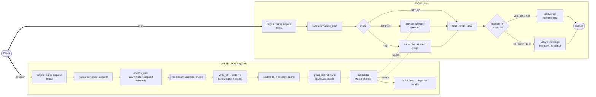
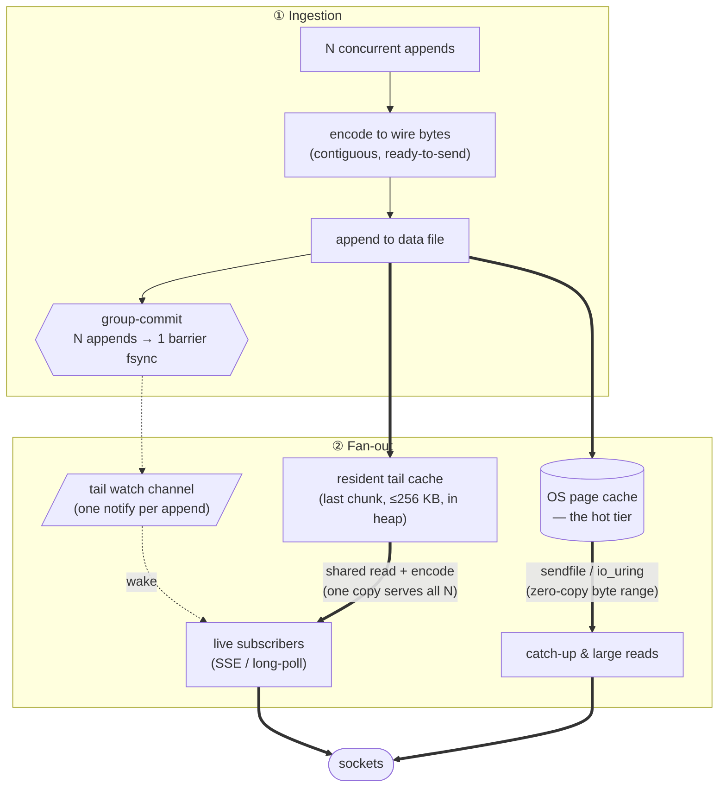
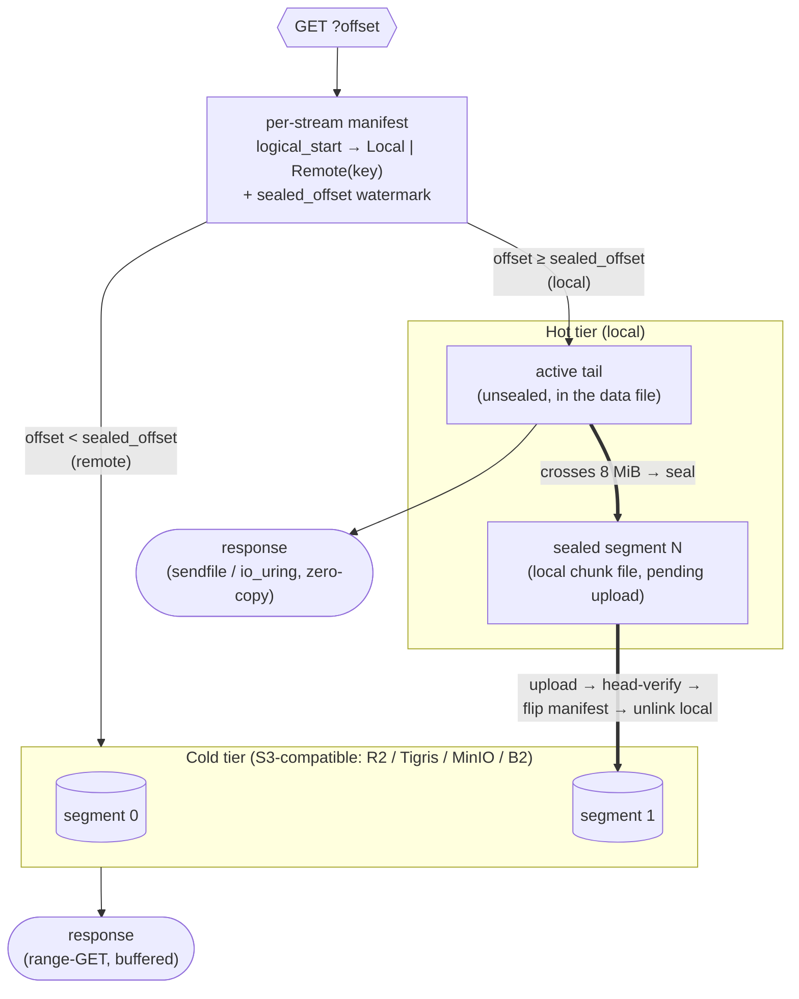

# Architecture & performance

A reference for how the Rust Durable Streams server is built and why it's fast.
The thesis in one line: **store each stream as the exact bytes that go on the
wire, so a write is an append and a read is a byte range** — then make the append
durable cheaply and the read leave the kernel as few times as possible.

- [The model](#the-model)
- [High-level: write path and read path](#high-level-write-path-and-read-path)
- [Write path in detail](#write-path-in-detail)
- [Read path in detail](#read-path-in-detail)
- [Keeping I/O fast from ingestion to fan-out](#keeping-io-fast-from-ingestion-to-fan-out)
- [Where the time goes](#where-the-time-goes)
- [Tiering: hot buffer → cold storage](#tiering-hot-buffer--cold-storage-optional)
- [Optional fast paths & observability](#optional-fast-paths--observability)

## The model

A stream is an append-only log. On disk it's a single contiguous data file
holding **exactly the wire bytes** a reader receives, plus a small `.meta`
sidecar for recovery. There is no per-message framing on disk, no reframing on
read, no database, no broker — just a process and a data directory
(`store::StreamState`).

Three things fall out of that choice:

- A **read is a `pread`/byte-range** of the file → it can be served with
  `sendfile(2)` (raw engine) or io_uring file reads (uring engine), kernel → socket.
- An **append is a `write` + an `fsync`** → durability cost is dominated by the
  fsync, which we amortize across concurrent writers.
- The **HTTP engine is pluggable** (`hyper` / `raw` / `uring`) behind an
  engine-agnostic `api::{Req, Resp, Body}` boundary; the handlers and storage are
  shared, only the I/O loop differs.

## High-level: write path and read path

The dotted edges are the only coupling between writers and readers: publishing
the new tail on a per-stream `watch` channel is what wakes live subscribers.
Everything else is independent.

## Write path in detail

`handlers::handle_append` (src/handlers.rs):

1. **Parse idempotency headers** — `Producer-Id` / `Producer-Epoch` / `Stream-Seq`.
   Duplicate `(producer, epoch, seq)` is acknowledged without re-appending
   (exactly-once producers).
2. **`encode_wire`** — turn the request body into the contiguous wire
   representation. In JSON mode this flattens arrays and appends the `,`
   delimiter so the on-disk bytes are already a valid stream fragment.
3. **Acquire the per-stream appender mutex** (`AsyncMutex<Appender>`). This is the
   _only_ serialization point, and it's per-stream — different streams never
   contend.
4. **`write_wire`** — `write_all` the bytes to the data file (they land in the OS
   page cache immediately), advance the tail under a short `RwLock` write, update
   the **resident tail cache**, then **publish the new tail** on the `watch`
   channel. Note the order: the cache is populated _before_ the wake, so a woken
   subscriber reliably hits it.
5. **Durability** — the append awaits the `SyncCoalescer`: concurrent appenders
   in flight share **one** barrier fsync (`F_BARRIERFSYNC` on macOS,
   `fdatasync` on Linux). The response returns only after the fsync that covers
   this append.

Visibility vs durability are deliberately decoupled: the bytes are in the page
cache (and the tail is published) before the fsync resolves, so a live reader
sees data with minimal latency, while the _appender_ still doesn't get its 2xx
until the data is durable.

## Read path in detail

`handlers::handle_read` parses the offset and dispatches by mode:

- **Catch-up** (`GET`, no `live`) — `read_range_body(start, tail)`. If the range
  is covered by the resident tail cache it returns `Body::Full` straight from
  memory; otherwise `tier::resolve_range` resolves the logical range to placement-
  aware slices (walking the fork parent chain for forked streams). If every slice
  is local (the live data file and/or sealed chunk files) it returns a zero-copy
  `Body::FileRange`; if any slice is remote it streams a bounded `Body::Channel`
  (one range-GET per remote segment).
- **Long-poll** (`live=long-poll`) — if the consumer is behind the tail, return
  the backlog immediately. Otherwise park on the stream's `watch` receiver until
  the next append or the timeout (204).
- **SSE** (`live=sse`) — spawn a task that subscribes to the `watch` channel and,
  on each tail change, reads the new range (cache fast-path), encodes it
  (`json` / `text` / `base64`), and pushes a frame onto an `mpsc` channel; the
  engine streams those frames as chunked transfer-encoding.

The body is then handed to the engine, which serves it with its best primitive:

| `Body` variant             | hyper                  | raw                           | uring                            |
| -------------------------- | ---------------------- | ----------------------------- | -------------------------------- |
| `Full` (cached / small)    | buffered write         | one coalesced write           | one io_uring send                |
| `FileRange` (large / cold) | buffered read + stream | **`sendfile(2)`** (zero-copy) | streamed **io_uring** file reads |
| `Channel` (SSE)            | chunked                | chunked                       | chunked                          |

## Keeping I/O fast from ingestion to fan-out

This is the diagram to anchor the performance story on — the byte flow and the
technique that keeps each hop cheap.

The techniques, each with its mechanism and payoff:

1. **Contiguous wire-byte storage.** The file _is_ the response. Reads are byte
   ranges with no reframing and no per-message copy — and this is what makes
   `sendfile`/io_uring zero-copy possible at all.
2. **Group-commit coalesced fsync.** The durability contract ("return after
   fsync") is the expensive part of an append. Concurrent appenders share a
   single in-flight barrier fsync, so throughput scales with the _batch size_ per
   fsync rather than one fsync per message. This is why unbatched appends hit
   ~30k/s where a per-append-fsync server (Node) does ~130/s.
3. **Per-stream single writer, lock-free reads.** One async mutex orders a
   stream's appends; there is no global lock (streams live in a `DashMap`).
   Reads take a brief tail snapshot and do positioned reads — they never block
   the writer and never wait on each other.
4. **Pre-fsync visibility.** Appended bytes are in the page cache and the tail is
   published before the fsync resolves, so live readers see data at memory
   latency; only the appender's acknowledgement waits for durability.
5. **`watch`-channel wakeups.** Live readers park on a per-stream `watch`; an
   append is one `send_replace` that wakes all of them. No polling loop, no timer
   churn.
6. **Resident tail cache (fan-out de-duplication).** Without it, N caught-up
   SSE/long-poll subscribers each re-read (and re-encode) the _same_ just-appended
   bytes — N× duplicated work that grows with audience size. The cache keeps the
   last chunk in the heap so all N share one read (and SSE encodes once per
   subscriber off that shared buffer). For small hot reads it's also fewer
   syscalls than `sendfile` and skips the read-offload pool hop.
7. **Zero-copy / async egress.** `raw` serves `FileRange` reads with `sendfile`
   (page cache → socket, no userspace copy → ~5× less CPU per byte than a
   buffered copy). `uring` issues the file reads and socket sends as io_uring
   operations (batched submit/complete, no epoll round-trip). The
   **`--read-offload`** strategy keeps a cold backfill's disk fault off the async
   workers so one slow read can't stall unrelated requests.
8. **Bounded memory everywhere.** Large reads stream in fixed chunks (the resident
   cache is capped at 256 KB; the uring engine streams cold reads in 256 KB
   windows) so serving a multi-GB backfill costs ~a chunk of RAM, not the read
   size.

## Where the time goes

The hot read path is essentially syscall-bound — at 1 KB it's recv + send (+ a
file read for cold data) with almost no application CPU — which is why the engine
choice (epoll + sendfile vs io_uring batching) is the lever, not the handler
code. The append path is fsync-bound, which is why group-commit is the lever
there.

Measured headlines (full tables and methodology in
[`bench/RESULTS.md`](bench/RESULTS.md)):

- **vs the reference Node server:** ~21× lower latency, ~31× small-message
  throughput, ~254× unbatched appends, ~7× read throughput.
- **Small hot reads (Linux):** `uring` 419k req/s @ p50 103 µs > `raw` 355k @
  148 µs > `hyper` 212k @ 202 µs — io_uring batching wins the syscall-bound case.
- **Large resident reads:** `raw`/`sendfile` sustains ~30 GB/s at ~273% CPU vs
  `hyper` ~14 GB/s at ~685% — **~5× less CPU per byte** (zero-copy vs userspace
  copy).
- **Cold-read isolation:** `raw --read-offload tail` caps the worst-case hot-read
  latency at ~11 ms where serving cold reads inline collapses to ~700 ms.

## Tiering: hot buffer → cold storage (optional)

Opt-in (`--tier`, off by default). The append-only, immutable-by-position model
makes tiering almost free: once data leaves the live tail it never changes, so the
server breaks each stream into fixed-size, CDN-friendly **segments** (default
8 MiB), **seals** them, and offloads them to object storage — keeping only the hot
tail local. Catch-up reads of cold history come from the object store (and a CDN
in front of it); the origin does little work for old data.

Key properties:

- **The manifest is the authority.** A read resolves each requested offset against
  the per-stream manifest (held in memory, persisted in the `.meta` sidecar): at or
  above `sealed_offset` → local (zero-copy `sendfile`/io_uring, unchanged); below it
  → the named object via range-GET, spliced into the response. A range spanning the
  boundary yields a mix.
- **Durability is never weakened.** An append still acks only after the local
  group-commit fsync. Offload is strictly _post-durability_: seal → upload →
  `head`-verify → durably flip `local → remote` → _only then_ unlink the staged
  chunk file. So a read never routes to an object that isn't there.
- **Chunk reclaim only; live-file reclaim deferred.** Sealed segments are separate
  chunk files, so reclaiming a chunk is an `unlink` — safe even under an in-flight
  read (Unix keeps an open fd readable after unlink). The live data file's sealed
  region is **not** reclaimed: hole-punching (`fallocate`) a shared file races with
  the engines' in-flight lazy reads (`sendfile` / `Body::FileRange`) into the
  just-sealed tail, which would read zeros from the freed blocks. Safe live-file
  reclaim needs read/punch coordination (epoch/refcount) or compaction and is a
  planned follow-up; until then the live file retains the sealed prefix (extra disk,
  no correctness or race risk).
- **JSON-safe sealing.** A JSON seal boundary always lands on a whole-value
  boundary (a byte-level scanner that ignores commas/brackets inside strings and
  honours escapes), so a sealed segment still reads back wrapped as `[ … ]`.
- **CDN-native.** Fully-sealed ranges are immutable, so they're served with
  `Cache-Control: immutable` and a long max-age — the CDN absorbs repeat cold reads
  before they reach the origin or the object store.

Caveat (current): a cold read materializes its segments into memory (`Body::Full`)
rather than streaming chunk-by-chunk (`Body::Channel`) — fine for moderate segment
sizes, a planned follow-up for very large cold ranges.

## Optional fast paths & observability

- **`splice(2)` binary appends** (`--splice-appends`, raw + Linux, off by default).
  Binary streams store the body verbatim, so the append body can move socket → file
  in the kernel with no userspace copy. It's a **CPU** lever (same append rate at
  roughly half to a third of the server CPU), not a throughput one — appends are
  fsync-bound. JSON (which transforms the body) and chunked bodies fall back.
- **OpenTelemetry** (`--features telemetry`, off by default, zero-cost when off).
  A `ds.request` span plus lean, bounded-cardinality metrics aimed at the two
  pivots this document keeps returning to: **`ds.append.fsync.batch_size`**
  (group-commit health) and **`ds.read.offload.wait`** (cold-read pool pressure),
  alongside fsync/lock-wait/append/read latency histograms and the tail-cache hit
  ratio. This is how you watch the levers above in production.
