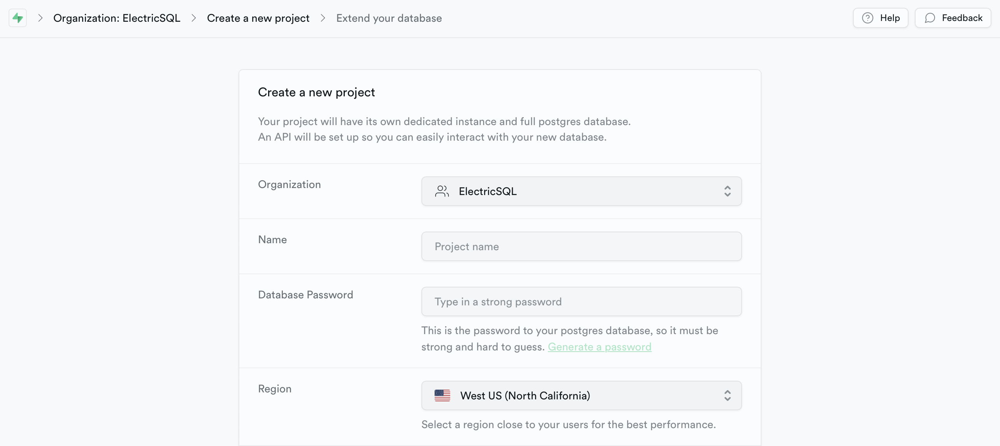
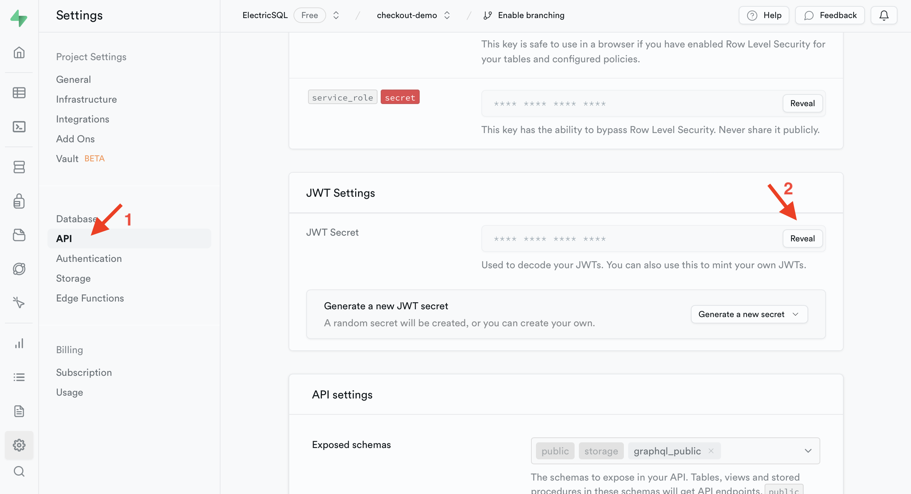
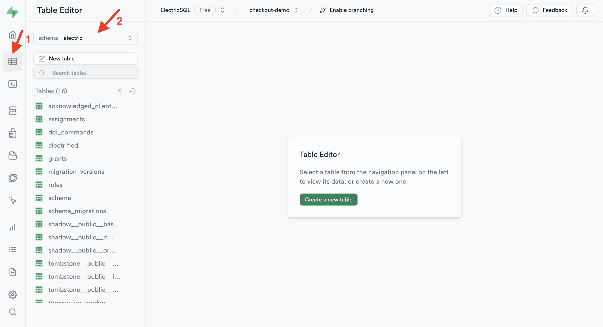

ElectricSQL works with [Supabase](https://supabase.com).

We support both the hosted [Supabase Platform](https://supabase.com/docs/guides/platform) and [self-host, open source](https://supabase.com/docs/guides/self-hosting) Supabase.

Supabase is an open source Firebase alternative. It provides a Postgres database, authentication, APIs, edge functions, realtime subscriptions, storage and vector embeddings. Supabase is **not** an application or web service host. To use Electric with Supabase, you still need to deploy your own Electric sync service.

:::caution Troubleshooting connectivity issues with Supabase Platform
Supabase Platform [dropped IPv4 support](https://supabase.com/docs/guides/platform/ipv4-address) for direct database connections on 26 January 2023. Following that, you may see "socket closed" errors in Electric's logs or it may seem like Electric is stuck without producing any log output at all.

The network where Electric is running must support IPv6. If you're running Electric on your own computer, check whether your ISP has IPv6 support on https://test-ipv6.com. If you see "No IPv6 address detected" on that page, consider using a VPN service that works with IPv6 networks, such as Proton VPN.

When running Electric in a Docker container, there's an additional hurdle in that Docker does not enable IPv6 out-of-the-box. Follow the [official guide](https://docs.docker.com/config/daemon/ipv6/#use-ipv6-for-the-default-bridge-network) to configure your Docker daemon for IPv6.

If you are subscribed to the Pro or Team plan on Supabase Platform, you can side-step those hurdles by purchasing the [IPv4 add-on](https://supabase.com/docs/guides/platform/ipv4-address#enabling-the-add-on) from Supabase to make your database host available at an IPv4 address.
:::

## How to connect Electric to Supabase Postgres

1. [Setting up a Supabase Postgres](#1-setting-up-a-supabase-postgres)
2. [Retrieving the connection details from the Supabase dashboard](#2-retrieving-the-connection-details)
3. [Retrieving the authentication key](#3-retrieving-the-authentication-key)
4. [Configuring Electric to connect to Supabase](#4-configuring-electric-to-connect-to-supabase)
5. [Verifying Electric initialisation](#5-verifying-electric-initialisation)
6. [Electrifying tables](#6-electrifying-tables)

Using other Supabase tools with Electric:

- [Supabase Auth](#supabase-auth)
- [Supabase Edge Functions](#supabase-edge-functions)

### 1. Setting up a Supabase Postgres

If you don't yet have a Supabase account visit [supabase.com](https://supabase.com) and create one.

Log in to your Supabase dashboard and click "New Project". In the form enter a name for the database, and a password that will be used to connect to it. Make a note of this password and save it somewhere secure.



Select an AWS region for your database to be hosted in. To reduce latency, we recommend that this is close to, or ideally in same region as, your Electric sync service.

Create the new project and wait a few moments for it to be setup.

:::info
All Supabase Postgres instances come with logical replication enabled and the permissions needed for Electric to work.
:::

### 2. Retrieving the connection details

Go to "Project Settings" (look for the gear icon at the bottom of the icon menu on the left hand side of the page) and open the "Database" section. Under the heading "Connection string" select the `URI` tab. Copy the connection string shown and save it somewhere.

:::info
Electric needs to establish a replication connection to the database, so it has to connect to it directly, not through a connection pool. Make sure to uncheck the "Use connection pooling" option when copying the connection string.
:::


You will use this as the value for the `DATABASE_URL` in your [Electric sync service configuration](../api/service.md).

:::caution

Make sure you're familiar with Supabase's recent abolition of IPv4 addresses for direct database connections. See the troubleshooting notice [at the top of this page](#) for details.
:::

### 3. Retrieving the authentication key

Now open the "API" section of the project settings. Scroll down to the "JWT settings". Reveal and copy the "JWT Secret" value. Save it somewhere secure.



You will use this as the value for `AUTH_JWT_KEY` in your [Electric sync service configuration](../api/service.md).

### 4. Configuring Electric to connect to Supabase

Run your [Electric sync service](../api/service), either locally or [via one of the other deployment options](../top-level-listings/deployment.md), with the following [configuration options](../api/service.md):

- set `AUTH_JWT_ALG` to `HS256` to enable secure auth mode with the right signing algorithm
- set `AUTH_JWT_KEY` to the "JWT Secret" value you retrieved in step 3 above
- set `DATABASE_URL` to the connection string you retrieved in step 2 above
- set `ELECTRIC_WRITE_TO_PG_MODE` to `direct_writes`
- set `PG_PROXY_PASSWORD` to a secure password value and note it down

Depending on how you run Electric these could be passed as arguments to Docker, set in a ENV file or entered into a managed host's dashboard. For example, to run Electric locally using Docker (replacing the `...` placeholder values with your specific values):

```shell
docker run \
    -e "AUTH_JWT_ALG=HS256" \
    -e "AUTH_JWT_KEY=..." \
    -e "DATABASE_URL=..." \
    -e "ELECTRIC_WRITE_TO_PG_MODE=direct_writes" \
    -e "PG_PROXY_PASSWORD=..." \
    -e "PG_PROXY_PORT=65432" \
    -p 5133:5133 \
    -p 65432:65432 \
    electricsql/electric
```

This will start Electric and connect it to your Supabase database. Logs will be printed to the terminal allowing you to see any errors that may occur.

:::info
Supabase support was enabled in Electric v0.8, you should ensure that docker pulls at least that version. You can specifically use 0.8 by using the tagged version: `electricsql/electric:0.8`.
:::

### 5. Verifying Electric initialisation

You can verify that Electric has initialised your database sucessfully using the Supabase dashboard. Select your project, then go to the "Table Editor" on the navigation menu. You should see a left-hand side menu listing any tables in your database with a "Schema" menu above.



Click this menu, and check that there is now an `electric` schema in your Postgres database. This confirms that the sync service has successfully initialised your database.

### 6. Electrifying tables

Electric works by [electrifying](../usage/data-modelling/electrification.md) tables to opt them in to the Electric sync machinery. To do this, you will need to apply [DDLX statements](../api/ddlx.md) via the Electric [migrations proxy](../usage/data-modelling/migrations.md#migrations-proxy). Specifically, you need to:

1. connect to the Electric sync service using the `PG_PROXY_PORT` and the `PG_PROXY_PASSWORD` you configured above (either directly using psql, or by configuring the correct connection string for your migrations tooling)
2. then use the `ALTER TABLE <name> ENABLE ELECTRIC` syntax to electrify tables

For full details on how to run migrations see our [migrations documentation](../usage/data-modelling/migrations.md). However, for example, to connect via psql to the sync service running on localhost:

```shell
PGPASSWORD=${PG_PROXY_PASSWORD} psql -U postgres -h localhost -p 65432 electric
```

You can then electrify tables, e.g.:

```shell
electric=# ALTER TABLE public.items ENABLE ELECTRIC;
ELECTRIC ENABLE
```

This will opt the `items` table in your public schema in to sync via Electric.

:::caution
The permissions system for Electric is still in development. Electrified tables are exposed to the public Internet. [See our roadmap for details](/docs/reference/roadmap).
:::

:::caution
Supabase has point-and-click tools for designing a database schema. This is a great way to get started when designing your data model.

However, ***once you have electrified a table***, you will need to apply any DDL schema changes to it via the same migrations proxy. This means that once you have electrified a table, you won't be able to update the schema of that table via the Supabase dashboard.
:::

## Using other Supabase tools with Electric

Supabase provides a suite of tools that pair well with Electric when building local-first apps, these include [Supabase Auth](#supabase-auth) and [Supabase Edge Functions](#supabase-edge-functions).

### Supabase Auth

[Supabase Auth](https://supabase.com/docs/guides/auth) works as an authentication solution for Electric. Authenticate using Supabase following the instructions in the [Supabase Auth documentation](https://supabase.com/docs/guides/auth). Use the JWT returned by Supabase Auth as the [auth token for the Electric replication connection](../usage/auth/token.md).

#### Configuring Electric to work with Supabase Auth

See the sections above on [Retrieving the authentication key](#3-retrieving-the-authentication-key) and [Configuring Electric to connect to Supabase](#4-configuring-electric-to-connect-to-supabase).

#### Authenticating the Electric client connection

Having authenticated a user, set the `session.access_token` returned by `supabase.auth.getSession()` as the value for `config.auth.token` when electrifying your database connection.

For example:

```ts
import { createClient } from '@supabase/supabase-js'
import { ElectricDatabase, electrify } from 'electric-sql/wa-sqlite'
import { schema } from './generated/client'

// Initiate your Supabase client
const supabaseUrl = import.meta.env.ELECTRIC_SUPABASE_URL
const anonKey = import.meta.env.ELECTRIC_SUPABASE_ANON_KEY
const supabase = createClient(supabaseUrl, anonKey)

// Construct the config for Electric using the user's JWT
const { data } = await supabase.auth.getSession()
const config = {
  auth: { 
    token: data.session.access_token
  },
  url: import.meta.env.ELECTRIC_URL,
}

// Initiate your Electric database
const conn = await ElectricDatabase.init('myApp.db', '')
const electric = await electrify(conn, schema, config)
```

You can see an example of this pattern in our [Checkout Example](../examples/checkout.md).

### Supabase Edge Functions

Many apps need to run code on the server in response to user actions. For example, to handle [secure transactions](/blog/2023/12/15/secure-transactions-with-local-first).

A great way to do this with Supabase is to use a combination of Postgres triggers and Edge Functions. This pattern is documented in the [Supabase event sourcing guide](../integrations/event-sourcing/supabase.md).
