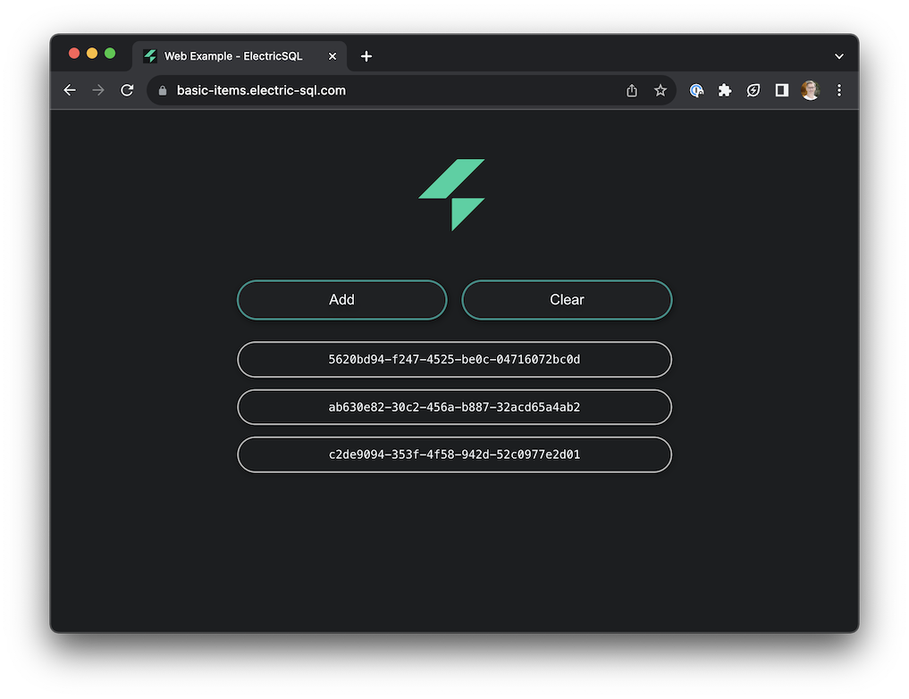

import QRCode from 'react-qr-code'
import BrowserOnly from '@docusaurus/BrowserOnly'

# Basic example

See the basic web example running online at [basic-items.electric-sql.com](https://basic-items.electric-sql.com):

<div className="my-6">

[](https://basic-items.electric-sql.com)

</div>

It's a basic app running in the web browser [using wa-sqlite](../integrations/drivers/web/wa-sqlite.md). You can also open in your mobile browser by scanning this QR code:

<div className="grid grid-cols-1 gap-4 my-6 mb-8">
  <div className="tile">
    <div className="px-3 md:px-4">
      <div className="my-2 sm:my-3 md:my-4 --w-8 --sm:w-9 --md:w-10">
        <div className="flex flex-row">
          <div className="qr-container">
            <BrowserOnly>
              {() => (
                <a href="https://basic-items.electric-sql.com" target="_blank">
                  <QRCode value="https://basic-items.electric-sql.com" />
                </a>
              )}
            </BrowserOnly>
          </div>
          <div className="ml-8 sm:ml-10 lg:ml-12 -mt-1 sm:-mt-0">
            <a href="https://basic-items.electric-sql.com">
              <h3>
                Open in mobile browser
              </h3>
              <p className="text-small mb-2 max-w-sm">
                Scan to open the demo app above in your mobile phone's web browser.
              </p>
            </a>
          </div>
        </div>
      </div>
    </div>
  </div>
</div>

## Source code

Clone the monorepo:

```shell
git clone https://github.com/electric-sql/electric
```

Change into the `web-wa-sqlite` example directory:

```shell
cd electric/examples/web-wa-sqlite
```

Follow the instructions in the [README.md](https://github.com/electric-sql/electric/blob/main/examples/web-wa-sqlite/README.md) and see the page here on [running the examples](./notes/running.md).
