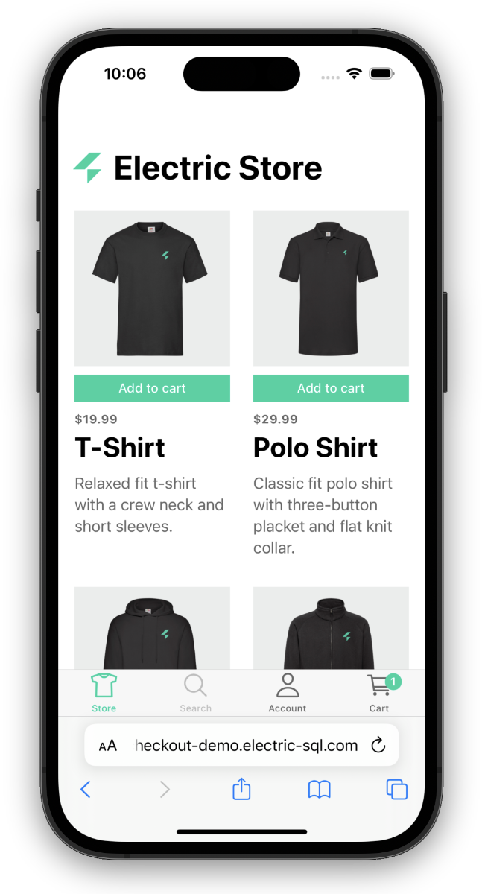

import QRCode from 'react-qr-code'
import BrowserOnly from '@docusaurus/BrowserOnly'

# Checkout example

<div className="sm:float-right sm:w-2/5">

  [](https://checkout-demo.electric-sql.com)

</div>

This is an example of an online store and checkout built using Electric. It additionally uses the Supabase suite of tools to both host the Postgres database, as well as using Supabase Auth, and Edge Functions. Finally, the UI is built with the Ionic framework.

Authentication for the store uses Supabase Auth, using their standard form component, and then uses the same JWT token for authenticating with the Electric sync service.

A Supabase Edge Function is used to process orders when they are placed. This is a called from an "on insert" trigger on the orders table in Postgres. When an order is placed, the order is entered as a row into the local orders table in the app; this is then synchronised with the Postgres table. This [Event Sourcing](../integrations/event-sourcing/) architecture enables a local-first checkout experience.

For details on how to deploy Electric with Supabase, how you can use Supabase Auth as the authentication system for your Electric app, and how to configure Edge Function for event sourcing, see <DocPageLink path="integrations/deployment/supabase" />.

You can also open in your mobile browser by scanning this QR code:

<div className="grid grid-cols-1 gap-4 my-6 mb-8 clear-both">
  <div className="tile">
    <div className="px-3 md:px-4">
      <div className="my-2 sm:my-3 md:my-4 --w-8 --sm:w-9 --md:w-10">
        <div className="flex flex-row">
          <div className="qr-container">
            <BrowserOnly>
              {() => (
                <a href="https://checkout-demo.electric-sql.com" target="_blank">
                  <QRCode value="https://checkout-demo.electric-sql.com" />
                </a>
              )}
            </BrowserOnly>
          </div>
          <div className="ml-8 sm:ml-10 lg:ml-12 -mt-1 sm:-mt-0">
            <a href="https://checkout-demo.electric-sql.com">
              <h3>
                Open in mobile browser
              </h3>
              <p className="text-small mb-2 max-w-sm">
                Scan to open the checkout demo app in your mobile phone's web browser.
              </p>
            </a>
          </div>
        </div>
      </div>
    </div>
  </div>
</div>

## Source code

Clone the monorepo:

```shell
git clone https://github.com/electric-sql/electric
```

Change into the `checkout` example directory:

```shell
cd electric/examples/checkout
```

Follow the instructions in the [README.md](https://github.com/electric-sql/electric/blob/main/examples/checkout/README.md).
