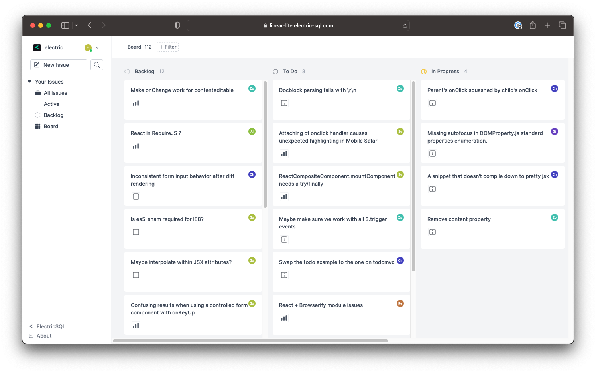

import QRCode from 'react-qr-code'
import BrowserOnly from '@docusaurus/BrowserOnly'

# LinearLite example

This LinearLite example is a simplified clone of [Linear](https://linear.app) developed using ElectricSQL. You can open it online at [linear-lite.electric-sql.com](https://linear-lite.electric-sql.com):

<div className="my-6">

[](https://linear-lite.electric-sql.com)

</div>

You can also open in your mobile browser by scanning this QR code:

<div className="grid grid-cols-1 gap-4 my-6 mb-8">
  <div className="tile">
    <div className="px-3 md:px-4">
      <div className="my-2 sm:my-3 md:my-4 --w-8 --sm:w-9 --md:w-10">
        <div className="flex flex-row">
          <div className="qr-container">
            <BrowserOnly>
              {() => (
                <a href="https://linear-lite.electric-sql.com" target="_blank">
                  <QRCode value="https://linear-lite.electric-sql.com" />
                </a>
              )}
            </BrowserOnly>
          </div>
          <div className="ml-8 sm:ml-10 lg:ml-12 -mt-1 sm:-mt-0">
            <a href="https://linear-lite.electric-sql.com">
              <h3>
                Open in mobile browser
              </h3>
              <p className="text-small mb-2 max-w-sm">
                Scan to open the LinearLite demo app in your mobile phone's web browser.
              </p>
            </a>
          </div>
        </div>
      </div>
    </div>
  </div>
</div>

[Linear](https://linear.app) is a modern project management app, developed on a [local-first architecture](https://linear.app/blog/scaling-the-linear-sync-engine).

This example is based on the excellent [linearapp_clone](https://github.com/tuan3w/linearapp_clone) developed by [Tuan Nguyen](https://github.com/tuan3w), with the data layer swapped out to use Electric. The dataset in the example is seeded with a set of public GitHub issues from the ReactJS project. The data is reset every 24 hours.

## Source code

Clone the monorepo:

```shell
git clone https://github.com/electric-sql/electric
```

Change into the `linearlite` example directory:

```shell
cd electric/examples/linearlite
```

Follow the instructions in the [README.md](https://github.com/electric-sql/electric/blob/main/examples/linearlite/README.md) and see the page here on [running the examples](./notes/running).
