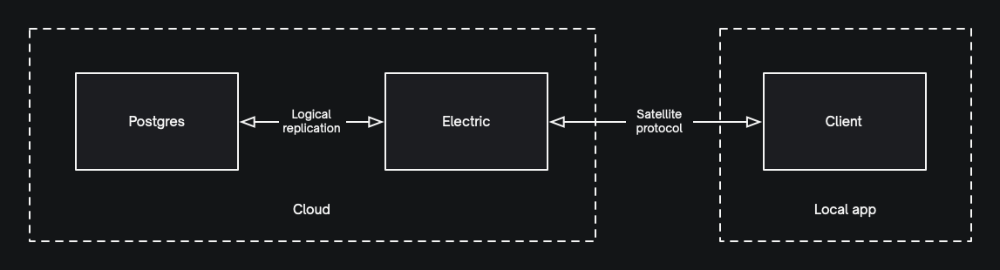
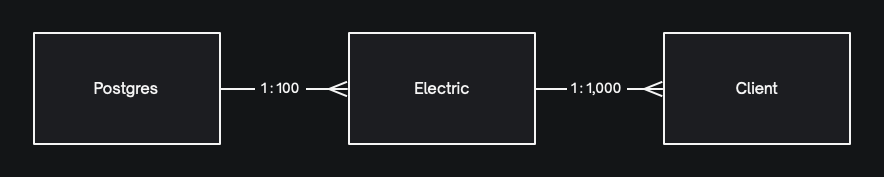
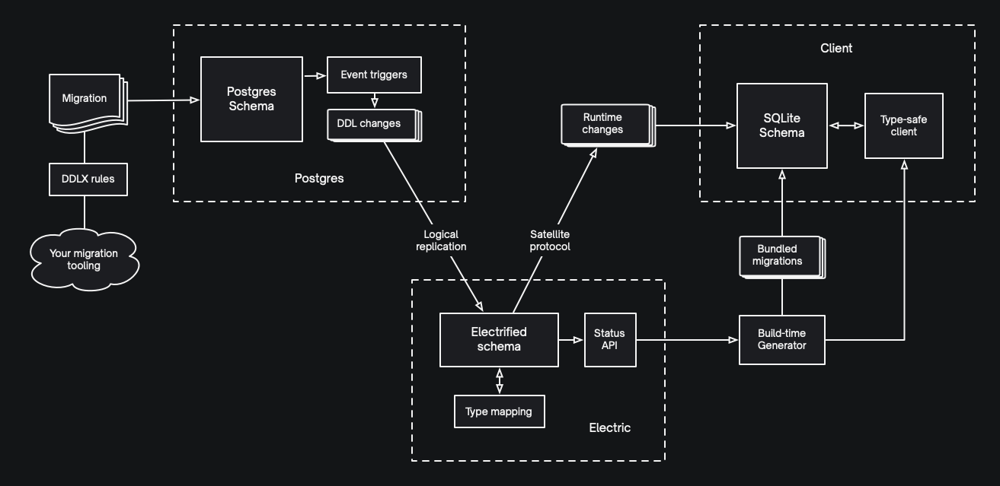
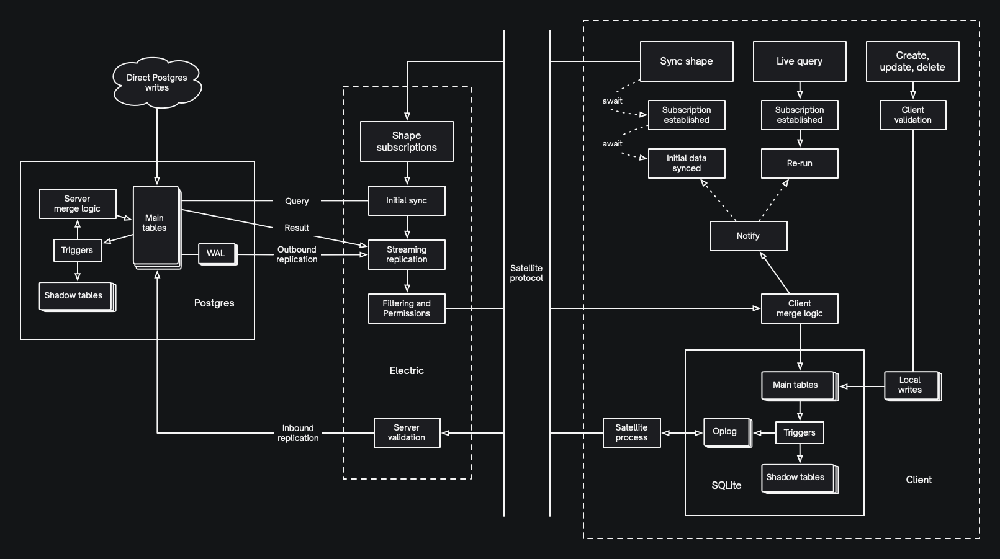
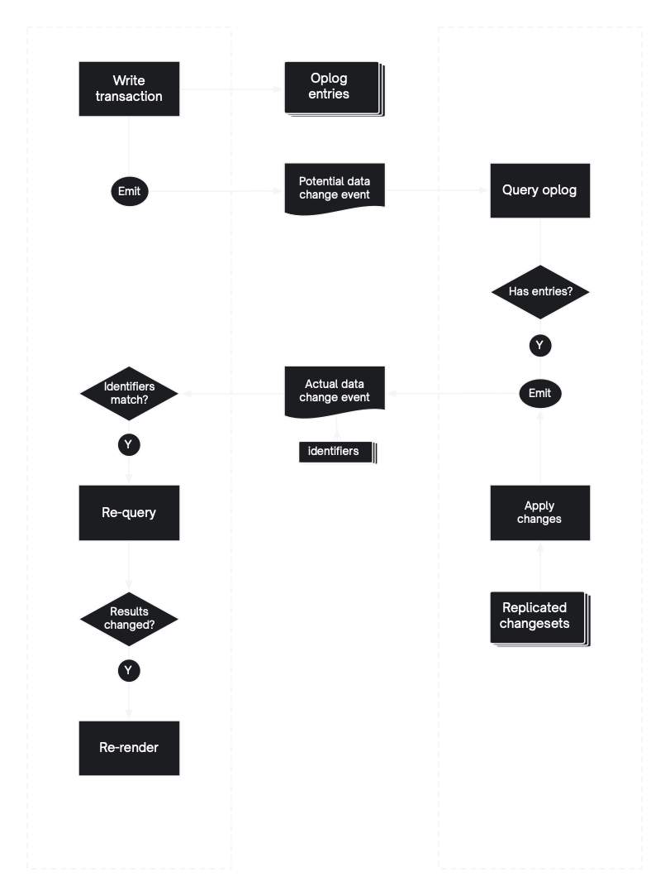

This page provides a high-level overview of the ElectricSQL system.

It covers the core components and how they fit together, how schema evolution works, how data flows through the system and how the in-client reactivity works.

:::note
If the embedded diagrammes are too small to read, you can click to open them as standalone images.
:::

## Primary components

ElectricSQL has three primary components. [Postgres](../usage/installation/postgres.md), the [Electric sync service](../usage/installation/service.md) ("Electric") and the [client-side library](../usage/installation/client.md) loaded in the local-first app (the "Client"). These are connected over Postgres logical replication and the [Satellite web-socket protocol](../api/satellite.md).

Inside the Client there is a [generated](../api/generator.md) type-safe [data access library](../usage/data-access/client.md). A [satellite replication process](https://github.com/electric-sql/electric/blob/main/clients/typescript/src/satellite/process.ts) (per named local database), SQLite [driver adapters](../integrations/drivers/index.md) and a [reactivity system](#reactivity) with [front-end framework integrations](../integrations/frontend/index.md).

### Topology

Usually there is one central Postgres, which can have many Electrics in front of it, each of which can serve many Clients.

## Schema evolution

ElectricSQL is a relational system based on Postgres that syncs between Postgres and SQLite. Postgres and SQLite share a database schema. This schema is based on an exposed (["electrified"](../usage/data-modelling/electrification.md)) subset of the Postgres DDL schema. Electric streams changes to the schema into connected client applications over the satellite protocol.

### Propagating

The Postgres schema is managed using any [standard migration tooling](../usage/data-modelling/migrations.md) and annotated with [DDLX statements](../api/ddlx.md). These statements apply triggers that cause the electrified subset of the DDL schema (and its access rules) to be streamed out of Postgres into Electric over the logical replication stream.

### Bundling

Electric provides an HTTP "status API" to access the electrified DDL schema. In development, the [generator script](../api/generator.md) calls this API to pull down the schema and uses it to:

1. generate a type-safe data access library
2. write an array of SQLite-compatible migrations into an importable Javascript file

This library and the migrations are imported into the local app. When the app [instantiates the electric database client](../usage/data-access/client.md) the system ensures that the local database is up-to-date with the bundled migrations.

### Runtime changes

When the client connects to the replication stream over the [Satellite protocol](../api/satellite.md), the system verifies that the local app and server have compatible migrations. New migrations streamed into Electric over logical replication are then streamed into the clients over the Satellite protocol and applied to the local SQLite database.

This is done with [transactional causal consistency](./consistency.md). The DDL changes are marked as causal dependencies of any subsequent DML changes using that schema version, ensuring that the DDL changes are applied before any writes relying on them.

## Data flow

Data is synced onto local devices using [Shape subscriptions](../usage/data-access/shapes.md). Once data is synced into the local database, it can be queried using [static](../usage/data-access/queries.md#static-queries) and [live queries](../usage/data-access/queries.md#live-queries).

Local writes to SQLite are copied by triggers into the "oplog", an system table that keeps a log of pending write operations. In the local client app, the satellite process is in charge of replicating these operations over the [Satellite protocol](../api/satellite.md).

### Client read path

When a Shape subscription is established, Electric executes a query against Postgres to identify all of the rows that belong to the shape. These rows are then streamed up to the client over the Satellite protocol. This enables efficient initial sync of a whole shape.

In parallel, Electric monitors the ongoing logical replication stream. When changes arrive over logical replication that were made **after** the snapshot the initial query was made against, then each row is checked to see which shape subscriptions (if any) it belongs to. If the row matches a current shape subscription for the client, it is put onto the Satellite protocol to stream up to the client. This enables ongoing streaming following on from the initial sync.

Note that all rows synced from Electric to the client via the Satellite protocol run through the **same permissions and filtering logic**. Rows that match a shape subscription (no matter whether they arived via an initial query or ongoing logical replication) will only be replicated to the client if that client actually has [permission to read them](../usage/data-modelling/permissions.md).

### Merge logic

Once changes arrive at the client, the satellite process consuming the replication stream applies any necessary concurrent merge logic and applies the writes to the local database. Specifically, any incoming operations from the server (that did not originate from the client in the first place) have:

1. the changes from any overlapping concurrent writes in the oplog merged into them
2. any required [compensations](./consistency#rich-crdts) applied to maintain referential integrity

The satellite process then fires data change notifications, which triggers the [reactivity system](#reactivity).

### Local writes

Application code in the local app writes directly to the SQLite database using the [create, update and delete APIs](../usage/data-access/writes.md) from the type-safe database client. Before applying the writes, the client runs client-side validation to verify that the data is valid and will not be rejected once replicated.

:::caution
Direct writes to SQLite that don't use the client library will also be replicated by the satellite process. However, this skips validation, so is dangerous and best avoided.
:::

ElectricSQL aims to provide **finality** of local writes. That is to say: valid writes accepted locally should always be accepted by Electric and Postgres and never rejected unless invalid or unauthorised. This avoids having to code rollback handlers for local writes. This is key to simplifying local-first development.

Whilst local writes are final, they are still subject to concurrent merge semantics. One way to understand this is that writes are always *factored in* to the history, even if their operations are actually overridden by the semantics of the conflict resolution logic.

### Streaming into Electric

When the SQLite database migrations are generated from the Postgres DDL changes, triggers are added that automatically copy insert, update and delete operations on the tables to the "oplog" table. The satellite process then processes these operations by sending them to the Electric server over the Satellite protocol. Electric then applies server-side validation and authorisation before sending on to Postgres over the incoming logical-replication stream.

:::note
Electric acts as a [logical replication publisher](https://www.postgresql.org/docs/current/logical-replication.html). This is why you configure a `LOGICAL_PUBLISHER_HOST` when deploying the Electric sync service -- so that Postgres can connect to consume inbound logical replication.
:::

### Streaming into Postgres

When you electrify a table in the Postgres DDL schema, this installs triggers that handle insert, update and delete operations. When Postgres applies the operations from the inbound logical replication stream, these triggers fire and run database-side merge logic.

### Direct writes to Postgres

Postgres accepts direct writes as normal, i.e.: you can connect to Postgres using PSQL or any other Postgres driver and insert, update and delete data as normal. These changes trigger the same functions as replicated writes and are replicated in the same way.

### Streaming out to other clients

All writes to Postgres (direct or via inbound replication) stream back out through logical replication where they run through the [client read path](#client-read-path) described above.

## Reactivity

Application components keep data in sync by binding [live queries](../usage/data-access/queries.md#live-queries) to state variables. For example, using the [`useLiveQuery`](../integrations/frontend/react.md#useLiveQuery) hook. Live queries subscribe to data change events.

When the ElectricSQL client library makes a local write it fires an immediate notification to tell the satellite process that data *may have* changed. The satellite process then consults the oplog to see whether any actual data changes were captured by the triggers. If data has *actually* changed, it then fires a data change event notification.

Plus when applying incoming writes from the Satellite protocol replication stream, the process also fires data change notifications.

When notified that data has changed that *could potentially* affect the query result, the live query is re-run and the results are re-applied to the state variable. This causes components to re-render, which keeps the data on screen [live and reactive](../intro/multi-user.md).

## Connectivity

Satellite processes monitor the connectivity state of the network and their underlying web socket client connection. The potential states are:

- `available`: the network is up and the connection is available to be made
- `connected`: the web socket connection is active and replicating local writes
- `disconnected`: the web socket connection is not active
- `error`: there was an error when connecting
- `syncing`: the connection is active but is currently catching up with the server prior to replicating local writes

If the connection is disconnected manually (for example using the `toggle` functionn returned by the [`useConnectivityState`](../integrations/frontend/react.md#toggleConnectivityState) hook) then it won't automatically reconnect. Otherwise if disconnected due to a transient error or network connectivity then the web socket connection will try to reconnect automatically using a backoff algorithm.

## More information

See the reference pages on [Consistency](./consistency.md) and [Integrity](./integrity.md) and the [API documentation](../top-level-listings/api.md).
