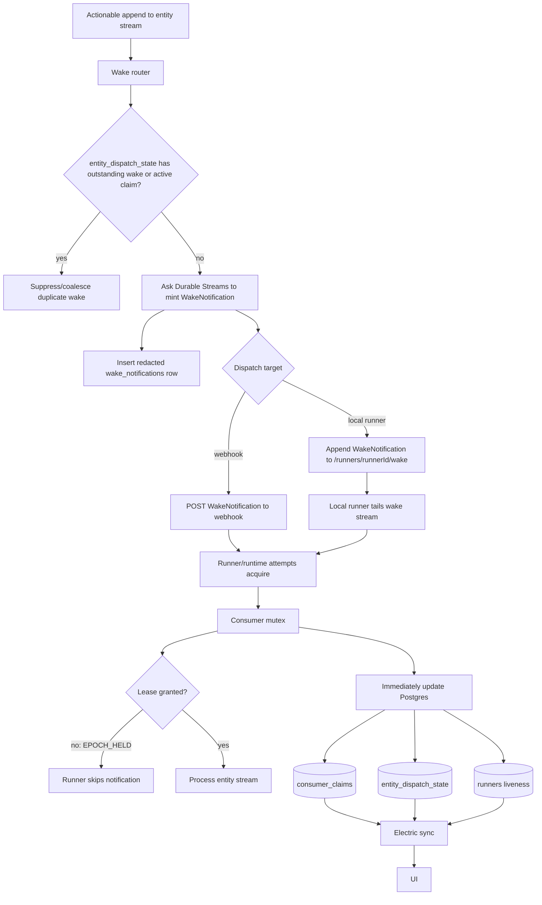
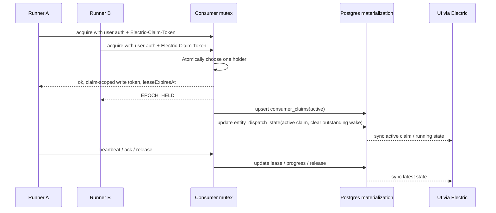
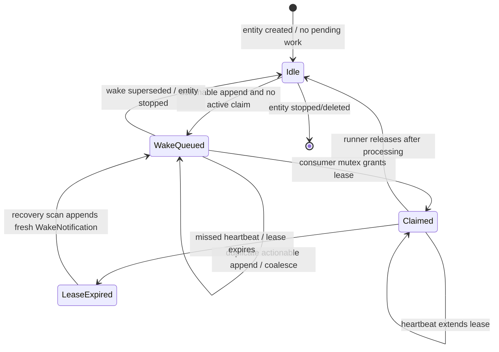
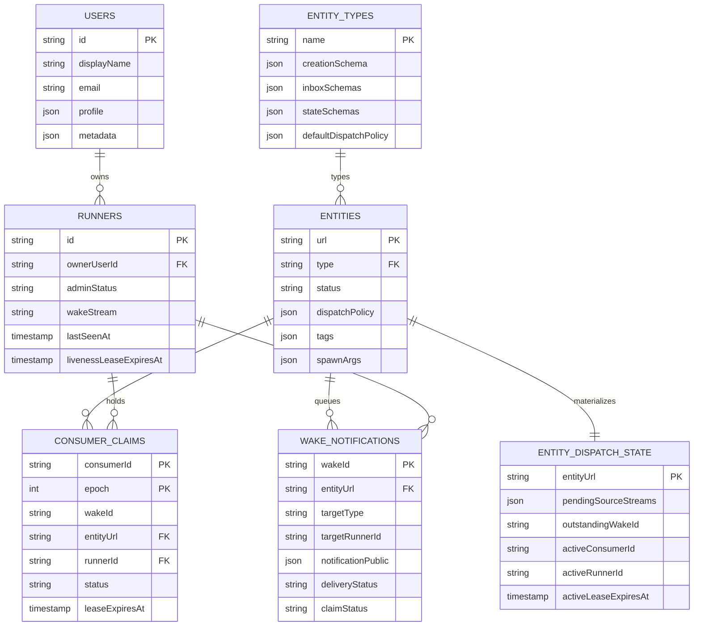

# RFC: Run Agents Anywhere — Local Runners, Worker Pools, and Sandboxes

## Summary

Distributed systems frequently need exactly-one ownership of a logical entity — a session, a workflow, a long-running agent. The existing answers each solve part of the problem: Durable Objects give you single-threaded actors with co-located storage, but tie you to Cloudflare's runtime. Distributed locks coordinate access but don't carry the work — a crash means the next holder starts over. Leader election scales to clusters, not to the 10⁶ fine-grained entities you actually have. Workflow engines (Temporal, Restate) get closer with durable execution, but their ownership model is task-queue-shaped, not entity-shaped.

Durable Streams' **consumer mutex** gives you global singleton ownership as a protocol. A stream is the unit of work. The mutex guarantees exactly one holder with an epoch, lease, and heartbeat. The stream itself carries both the work state and the wake notifications — no separate lock service, no DLQ, no retry infrastructure. If the holder crashes, the lease expires and the stream is claimable again.

Electric Agents entities are exactly this pattern — each entity is a durable stream with a singleton runner. Today webhooks are the only way to notify runners that work exists. This RFC extends that so runners can also **pull** wake notifications from wake streams, making the same singleton-ownership protocol work for laptops, worker pools, and serverless functions.

The user experience with Electric Agents is simple: **sign up for Electric Cloud or setup an Agents Server, connect the desktop app, and your laptop can run agents.** Start a coding session from your phone while you're on the go and it immediately runs on your laptop. Runner apps can build local development workflows on top. Worker pools and fallback routing are natural follow-on phases.

Under the hood, this requires three changes:

1. **Pull-wake delivery** — In addition to webhooks, runners can pull work from a durable wake stream.
2. **Entity information vs dispatch** — Separate "what an entity type is" from "how it gets delivered." This is what lets the same entity type route to a webhook, a local runner, or eventually a worker pool — without changing the entity itself.
3. **First-class runners** — Model local runners as named compute identities with status and dispatch routing. This is what makes "run on Kyle's MacBook" a real thing the system understands. Worker pools can build on the same protocol later.

---

## Motivation

### The experience we want

You connect to an Electric Agents server. You install the desktop app on your laptop and log in. The app registers your machine as a runner. Your laptop is now available to claim work routed to that runner.

You're on the train with your phone. You start a coding session — it immediately begins running on your laptop if that runner is online. If your laptop is offline, a later phase can route the session to a cloud sandbox or worker pool instead. The phone UI updates in real time via Electric sync.

All of this should feel as simple as signing into a chat app. The complexity — durable streams, consumer mutexes, wake routing, and runner identity — is infrastructure that the user never sees.

### What works today

Electric Agents entities are backed by durable streams. When an entity needs to run — because a message arrived, a cron fired, a child finished — the system sends a webhook to a registered URL. The webhook handler claims the entity's consumer mutex, processes events from the stream, acks its progress, and releases the claim. This model works well for cloud-hosted handlers with stable URLs.

### Where it falls short

**No local execution.** A laptop behind NAT can't receive webhooks. But laptops are where developers actually want to run coding agents, personal assistants, and dev workflows.

**No fallback or handoff.** If you start a coding session from your phone, there's no way to route it to your laptop or fall back to a cloud sandbox. The webhook either fires at a fixed URL or fails.

**No runner identity.** Today, whoever handles the webhook is the runner. There's no way to say "this entity should run on Kyle's MacBook" or "later distribute these agents across a worker pool of 10 sandbox workers."

**No clean separation of concerns.** Entity type metadata and webhook subscription mechanics are tangled together. This makes it hard to support alternative delivery or reason about entity types independently.

---

## Background: The Claim Protocol

Every entity has a durable stream — an append-only log of events. A **consumer mutex** protects concurrent access: only one runner can hold the active lease at a time. The holder gets a write token. Acks advance the cursor. Heartbeats extend the lease. If the holder crashes, the lease expires and the stream becomes claimable again.

Today, when an event is appended to an entity's stream, the system sends a webhook POST. The handler claims the mutex, processes the stream, and releases. But the webhook is just one way to say "work may exist." The claim — not the notification — determines who runs it.

Durable Streams already supports an alternative: **pull-wake**. Instead of POSTing a webhook, the server appends a wake event to a stream the runner is tailing. The runner reads the event and calls acquire on the entity's mutex. This is already implemented at the protocol level. What's missing is the Electric Agents integration: routing wake events to the right streams, modeling runners as first-class identities, and separating registration from webhook mechanics.

---

## Proposal 1: Pull-Wake Consumer Support

### Agent servers

An **agent server** is a scope for running Electric Agents — it contains entity registrations, runners, worker pools, and dispatch configuration. A user might run a personal server for their own agents or connect to a team server for shared work. A runner app can connect to multiple servers. Electric Cloud can make it easy to provision as many agent servers as you need.

OSS servers are a single shared scope: there is no tenant prefix in paths. Electric Cloud selects the server with a `?service=...` query parameter, mirroring the existing Electric pattern, so clients and CLIs can use the same URLs against OSS and Cloud.

### Wake streams

Each local runner gets a **wake stream** — a durable stream that carries wake notifications. Stream paths stay clean at the root. Worker-pool wake streams use the same idea in a later phase:

```
/runners/{runnerId}/wake                       # pinned runner wake stream
/worker-pools/{workerPoolId}/wake             # shared worker pool wake stream
```

When an entity needs to run, instead of (or in addition to) POSTing a webhook, the wake router appends a wake event to the appropriate stream.

### Wake notification generation

Agents Server should not hand-roll claim tokens or callback URLs. Instead, Durable Streams should expose an API that mints a claimable `WakeNotification` for a consumer/stream. That API is responsible for generating the signed callback URL, claim token, epoch, wake id, and source stream offsets. Agents Server then enriches the notification with entity context and dispatches it according to the entity's dispatch policy.

This same Durable Streams notification-minting path should be used for webhook delivery, pull-wake delivery, and future notification transports. The transport changes where the notification goes; it should not change the notification's claim semantics.

### Wake notification shape

Pull-wake should reuse the same notification payload shape that webhook runners already receive, rather than inventing a second wake format. The current runtime type is named `WebhookNotification`; it should become a generic notification type because the same payload is delivered by webhook POST and by runner wake streams:

```typescript
type WakeNotification = {
  consumerId: string
  epoch: number
  wakeId: string
  streamPath: string
  streams: Array<{ path: string; offset: string }>
  triggeredBy?: string[]
  callback: string
  claimToken: string
  triggerEvent?: string
  wakeEvent?: WakeEvent
  entity?: {
    type?: string
    status: string
    url: string
    streams: { main: string; error: string }
    tags?: Record<string, string>
    spawnArgs?: Record<string, unknown>
  }
}
```

There is no separate `entityId`; the entity identity is the entity path / stream path. For pull-wake, this exact notification queues in the runner's wake stream instead of being delivered by HTTP POST. The two delivery mechanisms should stay identical unless we discover a concrete reason they must diverge. The notification includes the callback/claim information needed to acquire the consumer mutex, and acquire is still checked against the authenticated user, runner ownership, dispatch target, and mutex state. Public/entity stream writes after acquire use the claim-scoped write token returned by the successful claim/acquire response, not a persistent entity token.

The notification delivered to a runner necessarily contains the claim token needed to call the signed callback. It must not contain an entity write token. Persistent entity write tokens are internal server-side secrets, not public write authorization for clients/runners, and should not be exposed in wake payloads, synced projections, or debug tables.

For this PR, callback-forward/header plumbing includes only a minimal local-runner safety gate: host apps may provide an `authenticateRequest` hook, and runner-target acquire checks require the authenticated user to own the enabled target runner and to send the matching runner id header. Broader spawn/acquire authorization remains deferred to a separate auth design.

### Write-token model

Persistent entity write tokens are internal server-side secrets. They are not public write authorization for clients, runners, wake payloads, or synced UI/debug projections, and v1 intentionally provides no backwards compatibility for entity-token writes. Initial/user-originated writes are server-mediated after normal server authentication and authorization.

Runner writes to an entity stream require a successful claim/acquire. The acquire response may return a **claim-scoped write token** bound to the granted consumer mutex claim/epoch; public/entity stream write APIs accept that claim-scoped token for the duration of the claim. These claim write tokens are process-local, ephemeral capabilities in v1: Durable Streams/Agents Server may keep them in memory, but they are not persisted, hashed, or materialized to Postgres. If the server restarts or loses the token, it fails closed; runtimes should reacquire or refresh the claim before continuing writes. This preserves the write hot path without a Postgres lookup per write while avoiding exposure of long-lived entity write secrets.

### Runner loop

A pull-wake runner is a simple loop:

```
tail wake stream from last offset
→ read wake event
→ POST wake.callback to acquire the entity's consumer mutex
  - Authorization carries the user's Agents Server session
  - Electric-Claim-Token carries the Durable Streams claim token
  - do not overload Authorization with the claim token
→ if claimed: process entity stream, ack/heartbeat, release
→ if conflict (EPOCH_HELD): skip, someone else got it
→ advance wake stream offset
→ repeat
```

### Delivery guarantees and recovery

Wake events are idempotent hints — the entity stream, consistent entity dispatch state, and consumer mutex are the source of truth, not the wake stream alone. Entity state should record whether there is an outstanding wake or active claim, so the wake router can suppress duplicate wakes. A runner that attempts to claim an already-claimed entity simply gets `EPOCH_HELD` and moves on.

If a runner crashes after acquiring the entity mutex but before finishing, the lease expires and the entity becomes claimable again. A recovery scan can detect entities with unprocessed stream offsets and no active lease/outstanding wake, then append fresh wake events and update entity dispatch state. This means wake stream offset advancement is safe — losing a wake event doesn't lose work, because the recovery scan provides the recovery path.

### Per-stream consumer mutex

Earlier Durable Streams designs allowed a consumer to claim multiple streams at once. This RFC simplifies to **one mutex per entity primary stream**. Most agent work is naturally per-entity and contention/cleanup/routing are all simpler per-stream. Entities can observe other streams without owning their mutexes.

### Unified processing path

Pull-wake should feed the same runtime path as webhook delivery. The difference is only transport:

- webhook delivery receives a `WakeNotification` by HTTP POST;
- pull-wake delivery reads the same `WakeNotification` payload from the runner wake stream.

The entity processing code should not care which transport delivered the notification. Runner apps decide how to execute an entity type after acquiring the stream; that execution model is not controlled by the server-side registration. Adding new wake mechanisms in the future requires only a new notification adapter, not changes to entity execution.

---

## Proposal 2: Entity Information and Dispatch as Separate Concerns

Today, entity type information and webhook subscription mechanics are tangled together. This proposal separates them into two independent concerns: **entity information** (what the entity type is and what streams it has) and **dispatch policy** (how runners get notified about work).

### Entity type registration

A **registration** is just the entity information: the entity type name, stream layout, and optional default dispatch policy. It does not define how a runner executes that entity type:

```typescript
type EntityTypeRegistration = {
  id: string
  entityType: string

  streamPrefix: string

  // Default dispatch policy for entities of this type
  defaultDispatchPolicy?: DispatchPolicy

  createdAt: string
  updatedAt: string
}
```

### Dispatch policy

A **dispatch policy** identifies where wake notifications for an entity should be delivered. The model allows multiple targets over time, but v1 restricts each entity to a single target:

```typescript
type DispatchPolicy = {
  // v1: exactly one target. Future: ordered targets with fallback.
  targets: [DispatchTarget]
}

type DispatchTarget =
  | { type: 'webhook'; url: string }
  | { type: 'runner'; runnerId: string }
  // future phase:
  | { type: 'worker-pool'; workerPoolId: string }
```

A webhook target POSTs the existing webhook notification payload. A runner target appends the same notification payload to the runner's wake stream. Ordered fallback and worker-pool dispatch are deferred; the shape keeps room for them without making them v1 behavior.

Examples:

- **Pinned local runner:** `[runner: kyle-macbook]` — wake events append to Kyle's runner wake stream.
- **Webhook only:** `[webhook: https://api.example.com/handle]` — same delivery model as today.
- **Future worker pool:** `[worker-pool: coding-agents]` — later, any worker pool member can claim.

### Per-entity dispatch policy

The dispatch policy is set **per-entity at spawn time**. This is what makes the phone→laptop story work — when Kyle spawns a coding session from his phone, he specifies his laptop runner:

```typescript
// At entity creation
{
  entityType: "coding-session",
  dispatchPolicy: {
    targets: [{ type: "runner", runnerId: "kyle-macbook" }]
  }
}
```

If no dispatch policy is specified at spawn, the entity uses the registration's `defaultDispatchPolicy`. This keeps the simple case simple — entity types with a single fixed webhook just set it as the default and never think about dispatch again.

In v1, an entity's dispatch policy is immutable after spawn. If work needs to move elsewhere, fork/spawn a new entity with a different dispatch policy. Active handoff and dispatch-policy migration can be tackled later if needed.

### Stream paths and control routes

Durable stream paths stay clean at the root. Entity streams encode routing metadata in the stream name:

```
/<stream-name>                         # stream operations for any durable stream
/{entityType}/{entityPath}/main          # entity primary stream
```

Technical/control routes live under the reserved `_electric` prefix so they cannot collide with stream names.

```
/_electric/entities/{entityType}/{entityPath}/...  # entity control operations
/_electric/subscriptions/...                     # webhook subscriptions
/_electric/consumers/...                         # consumers / mutex APIs
```

On append to an entity stream, the wake router uses the stream path/entity path to look up the entity and its dispatch policy (or the registration default) on the current server. This is a simple indexed lookup — no glob matching, no pattern scanning.

This dispatch wake router is separate from the current codebase's `WakeRegistry`, which manages entity-to-entity observation wakes / `wake_registrations`. The naming should stay distinct in implementation to avoid confusing entity observation with delivery dispatch; use a name like `DispatchWakeRouter` or `NotificationRouter`, and do not reuse `WakeRegistry`.

For v1, every app-visible append to an entity stream is actionable for dispatch. Internal control-plane bookkeeping — claim heartbeats, consumer acks, dispatch materialization rows, wake-notification debug records — must not recursively trigger dispatch wakes. Because entity dispatch state records outstanding wakes and active claims, the router can coalesce or suppress duplicate wakes deterministically.

### Registrations are runtime objects, not config files

Registrations should be stored in the database, queryable via API, synced to clients and runners via Electric, and auditable. They are part of the control plane, not deployment artifacts. The control plane routes work and enforces claims; it does not decide how a runner obtains code, starts processes, updates itself, or implements an entity type.

### User auth and ownership

Broad spawn/acquire authorization is out of scope for this PR and still needs a separate design exercise. This RFC/PR introduces the control-plane fields needed for that future design — user records, `ownerUserId` on runners, dispatch targets, runner liveness, and claim materialization — plus a narrow local-runner owner safety gate so requests cannot spawn/acquire work on another user's personal runner or manage it.

The narrow gate is intentionally small: a host-provided `authenticateRequest(req)` hook resolves `{ userId }`; runner registration uses that user as `ownerUserId` when configured; runner management routes require the authenticated user to own the runner; runner-target spawn and acquire require the authenticated user to own the enabled target runner; callback-forward acquire also requires `Electric-Runner-Id` or `X-Runner-Id` to match the entity's target runner. Webhook-only flows do not require this hook.

Future auth design should cover:

1. how a host app / OSS server authenticates a request and resolves or provisions a user record,
2. how Electric Cloud provides the same authenticated-user/user-provisioning flow,
3. how runner registration establishes `ownerUserId`,
4. how spawning an entity targeted at a runner is authorized,
5. how acquiring work is authorized against authenticated user, runner ownership, dispatch target, runner enabled status, capacity, and the consumer mutex.

The hook is about establishing user identity and ownership checks for this flow, not defining a broad policy language. With the hook configured, runner management routes are also owner-gated: callers list only their own runners and must own a runner before reading it, heartbeating it, or enabling/disabling it. Without the hook, those local-runner routes remain scaffold-only for development and manual testing. Broader production auth semantics still need the separate future design.

---

## Proposal 3: First-Class Runners, Worker Pools, and Dispatch Policies

### Runners as compute identities

A **runner** is a named compute resource that can claim and execute entity work:

```typescript
type Runner = {
  id: string
  ownerUserId?: string // required for user-owned local runners

  label: string // "Kyle's MacBook Pro"

  kind: 'local' | 'cloud-worker' | 'sandbox' | 'ci' | 'server'

  adminStatus: 'enabled' | 'disabled'
  liveness: 'online' | 'offline' // derived from heartbeat lease
  // activity is derived from active claims/capacity, not stored

  lastSeenAt?: string
  registeredAt: string

  // Server-maintained from consumer mutex state, not self-reported
  activeClaims: Array<{
    entityPath: string
    consumerId: string
    claimedAt: string
    leaseExpiresAt?: string
  }>

  wakeStreams: string[]
}
```

### Runner identity and auth

A runner is a control-plane object that dispatch policies can target. It is not a specification for how the runner process works internally.

This PR models runner identity and ownership fields and enforces only the minimal same-owner gate for runner-target spawn/acquire. The broader intended future model is that authentication identifies a user using whatever mechanism the host supports; the server stores or materializes that user as a user entity/record; and local runners are associated with an owning user id.

```
Kyle on phone: authenticated as user:kyle
  → can spawn entities and assign them to Kyle's runner

Kyle's laptop: authenticated as user:kyle / Kyle's runner app
  → can claim entity streams routed to Kyle's runner
```

This PR implements only those local-runner owner/enabled checks via a host-provided authenticated-user hook; the broader policy model and runner-specific cryptography or device credentials remain deferred.

Runner liveness should copy the claim heartbeat/lease semantics: a runner heartbeats to keep its liveness lease fresh, missed heartbeats make it offline, and the server records `lastSeenAt`/lease expiry using the same style of timing and recovery rules as active claims.

### Later phase: worker pools

Worker pools are deferred beyond the initial local-runner milestone. A future **worker pool** is a group of runners that compete for the same work:

```typescript
type WorkerPool = {
  id: string
  name: string
  wakeStream: string

  members: Array<{
    runnerId: string
    status: 'active' | 'disabled'
  }>

  capacityPolicy?: {
    maxConcurrentClaimsPerRunner?: number
    maxTotalClaims?: number
  }
}
```

All worker pool members tail the same wake stream independently — each runner maintains its own local cursor position. When a wake event arrives, multiple runners see it and may attempt to acquire. The consumer mutex ensures exactly one wins. Losers get `EPOCH_HELD` and move on. This "broadcast read, race to claim" model avoids shared-cursor coordination and means a losing runner never hides work from others.

### Dispatch policies

Per-entity dispatch policies (see Proposal 2), runner status, and eventually worker pool membership create flexible routing:

- **Pinned local runner:** Entity dispatch policy targets Kyle's MacBook.
- **Webhook only:** Entity inherits registration default — a single webhook target. Same as today.
- **Future worker pool distribution:** Entity targets a worker pool. Any worker pool member can claim.
- **User-owned local runner restriction:** local runners claim entities spawned by their owner and targeted at that runner.

---

## What This Unlocks

### Spawn from phone, run on laptop

```
1. Kyle opens phone, spawns coding-session with dispatch policy:
     [runner: kyle-macbook]
2. Server creates entity stream, appends initial message
3. Wake router appends the existing wake notification payload to Kyle's runner wake stream
4. Laptop runner reads the notification, acquires the entity mutex, and starts processing
5. Phone UI updates in real time via Electric sync
```

### Future worker pool load distribution

```
1. Entity receives work
2. Registration targets worker pool "coding-agents" (15 runners)
3. Wake event appended to the worker pool's shared wake stream
4. Several runners attempt acquire
5. Consumer mutex accepts first valid claim
6. Winner executes, losers move on
```

### Runner-app-specific workflows

Because the control plane only routes and claims work, runner apps are free to implement their own workflows. For example, a developer-focused runner could support hot reload by watching local files and sending a Unix-style `SIGHUP` signal to active entities:

```
1. Dev server watches local source files
2. File changes detected
3. `SIGHUP` signal sent to active entities
4. Entity finishes current activation gracefully
5. Runner releases claim, supervisor restarts subprocess
6. Entity resumes from durable cursor under new code
```

No server-side hot-reload primitive is required by this RFC. A runner app can build that behavior using normal entity messages/signals plus the durable claim lifecycle.

Similarly, workflows like self-modifying agents and fork-explore-converge are runner-app/application patterns. They can be built on top of durable entity streams, child entities, and the runner's own local execution model without making the control plane responsible for code management.

---

## Runner Implementation Is Out of Scope

The control plane does not decide how runners work internally. It routes wake events, checks user/runner ownership on acquire requests, and tracks liveness/claims. Once a runner has acquired an entity stream, the runner app decides how to handle that entity type.

That means this RFC does not define:

- code distribution,
- install/build/run commands,
- local checkout management,
- hot reload implementation,
- subprocess supervision,
- app update policy.

Those are runner-app concerns. For example, the Electron app with Horton can bundle its agents and distribute new app versions for updates, while another runner app might choose a different implementation strategy.

---

## Entity and Runner Observability

Entity status, runner status, wake notifications, and claim records should be captured in Postgres and synced to UIs via Electric. Current entity status values are `spawning`, `running`, `idle`, and `stopped`; "pending work" is a derived condition, not a new entity status.

| Entity / dispatch condition                | Runner State | UI Display                       |
| ------------------------------------------ | ------------ | -------------------------------- |
| `idle` + unclaimed work / outstanding wake | `offline`    | "Waiting for runner..."          |
| `idle` + unclaimed work / outstanding wake | `online`     | "Runner syncing pending work..." |
| `running`                                  | `busy`       | "Running on Kyle's MacBook"      |
| `idle`                                     | `idle`       | "Waiting for input"              |
| latest run failed                          | any          | "Run failed — check logs"        |

The combination of entity status, derived dispatch state, and runner liveness gives users a clear picture of what's happening without requiring them to understand the underlying protocol. This is especially important when a runner crashes: the UI cannot reliably infer crash/liveness/claim recovery from the entity stream alone, so it needs `entity_dispatch_state`, `consumer_claims`, and runner liveness materialized in Postgres and synced via Electric.

---

## Key Diagrams

### Wake delivery and claim flow



### Near-simultaneous acquire race



### Entity dispatch state lifecycle



### Proposed table relationships



---

## Proposed Postgres Tables

The consumer mutex remains the ultimate source of truth for active claim ownership because it is the component that must resolve near-simultaneous acquire requests. After each acquire, heartbeat, release, or expiry decision, the mutex path should immediately update Postgres so the state is durable, queryable, and synced to UIs via Electric.

### `users`

Built-in user records are required so local runners can be owned by users. Keep the base schema small and allow server-specific profile/metadata extension.

```typescript
type User = {
  id: string
  displayName?: string
  email?: string
  avatarUrl?: string

  // Host/Electric Cloud auth linkage. Shape may evolve.
  authProvider?: string
  authSubject?: string

  profile: Record<string, unknown>
  metadata: Record<string, unknown>

  createdAt: string
  updatedAt: string
}
```

### `entity_types`

Entity type registration is the current entity type metadata minus webhook delivery info. `serveEndpoint` should move out of the entity type record and become a webhook target inside `defaultDispatchPolicy`.

```typescript
type EntityType = {
  name: string
  description: string
  creationSchema?: unknown
  inboxSchemas?: unknown
  stateSchemas?: unknown
  revision: number

  // Optional default used when spawn does not provide a policy.
  defaultDispatchPolicy?: DispatchPolicy

  createdAt: string
  updatedAt: string
}
```

### `entities`

Entities keep their existing identity and status model. The entity path/URL is the id. Dispatch policy is captured at spawn and immutable in v1.

```typescript
type Entity = {
  url: string
  type: string
  status: 'spawning' | 'running' | 'idle' | 'stopped'

  dispatchPolicy: DispatchPolicy

  // Internal server-side secret only; not public write auth and not exposed.
  internalWriteToken: string
  tags: Record<string, unknown>
  spawnArgs: Record<string, unknown>
  parent?: string
  typeRevision?: number
  inboxSchemas?: unknown
  stateSchemas?: unknown

  createdAt: number
  updatedAt: number
}
```

### `entity_dispatch_state`

One row per entity materializes dispatch/recovery state. This is what lets the wake router know whether an entity already has an outstanding wake or active claim.

Offsets here are source/entity stream offsets carried by `WakeNotification.streams`, not wake-stream cursor offsets. Wake-stream offsets are runner-local cursors and are not the source of entity recovery truth.

```typescript
type EntityDispatchState = {
  entityUrl: string

  // Latest actionable source work observed for this entity.
  pendingSourceStreams: Array<{ path: string; offset: string }>
  pendingReason?: string
  pendingSince?: string

  // Outstanding wake, if any.
  outstandingWakeId?: string
  outstandingWakeTarget?: DispatchTarget
  outstandingWakeCreatedAt?: string

  // Active claim materialized from the consumer mutex.
  activeConsumerId?: string
  activeRunnerId?: string
  activeEpoch?: number
  activeClaimedAt?: string
  activeLeaseExpiresAt?: string

  lastWakeId?: string
  lastClaimedAt?: string
  lastReleasedAt?: string
  lastCompletedAt?: string
  lastError?: string

  updatedAt: string
}
```

### `wake_notifications`

Wake stream entries literally store `WakeNotification`. The Postgres table is a redacted materialization for querying/debugging and UI sync; it should not persist raw `claimToken` or any write token. Wake notifications must not include `writeToken` / `entity.writeToken` fields.

```typescript
type WakeNotificationRow = {
  wakeId: string
  entityUrl: string

  targetType: 'webhook' | 'runner' | 'worker-pool'
  targetRunnerId?: string
  targetWebhookUrl?: string
  runnerWakeStream?: string
  runnerWakeStreamOffset?: string

  // Redacted payload: enough for debugging/UI, without claim/write tokens.
  notificationPublic: OmitSecrets<WakeNotification>

  deliveryStatus: 'queued' | 'delivered' | 'failed' | 'superseded'
  claimStatus: 'unclaimed' | 'claimed' | 'completed' | 'expired'

  createdAt: string
  deliveredAt?: string
  claimedAt?: string
  resolvedAt?: string
}
```

Existing `wakeId`, `streams`, and `triggeredBy` fields are sufficient for v1 dedupe/debug.

### `runners`

Users can have multiple local runners. They should all show up in UI.

```typescript
type Runner = {
  id: string
  ownerUserId: string

  label: string
  kind: 'local' | 'cloud-worker' | 'sandbox' | 'ci' | 'server'

  adminStatus: 'enabled' | 'disabled'

  wakeStream: string

  // Claim-style heartbeat/lease semantics.
  lastSeenAt?: string
  livenessLeaseExpiresAt?: string

  createdAt: string
  updatedAt: string
}
```

`activity` does not need to be stored unless we find a reason; it can be derived from active claims and capacity.

### `consumer_claims`

The consumer mutex writes this table immediately after claim state changes. The mutex remains authoritative for resolving races; this table is the durable/queryable materialization. Use `(consumerId, epoch)` as the primary key, or use a synthetic id plus a unique `(consumerId, epoch)` constraint.

```typescript
type ConsumerClaim = {
  consumerId: string
  epoch: number

  wakeId?: string
  entityUrl: string
  streamPath: string
  runnerId?: string

  status: 'active' | 'released' | 'expired' | 'failed'

  claimedAt: string
  lastHeartbeatAt?: string
  leaseExpiresAt?: string
  releasedAt?: string

  // Optional source/entity stream progress for debugging/recovery.
  ackedStreams?: Array<{ path: string; offset: string }>

  updatedAt: string
}
```

---

## Proposed State Transitions

The Durable Streams consumer machinery is responsible for all consumer mutex decisions. Agents Server mirrors those decisions into Postgres immediately so UI and recovery can observe them.

| Event                                              | Consumer mutex action                | Postgres updates                                                                                                                                                                                                                |
| -------------------------------------------------- | ------------------------------------ | ------------------------------------------------------------------------------------------------------------------------------------------------------------------------------------------------------------------------------- |
| Entity spawned                                     | none yet                             | Insert `entities` with `dispatchPolicy`; insert `entity_dispatch_state` with no active claim/outstanding wake. Child entities inherit the parent's `dispatchPolicy` by default unless spawn explicitly overrides it.            |
| App-visible entity event appended                  | none yet                             | Wake router asks Durable Streams to mint `WakeNotification`; if no outstanding wake/active claim, insert redacted `wake_notifications`, set `entity_dispatch_state.outstandingWakeId`, append/post notification.                |
| Duplicate app-visible event while wake outstanding | none                                 | Merge/update `pendingSourceStreams`; keep existing outstanding wake.                                                                                                                                                            |
| Duplicate app-visible event while claim active     | none                                 | Merge/update `pendingSourceStreams`; do not append a new wake. Active runner will observe the stream.                                                                                                                           |
| Acquire accepted                                   | Grant lease, epoch, write token      | Insert/update `consumer_claims(active)` keyed by `(consumerId, epoch)`; clear outstanding wake; set active claim fields in `entity_dispatch_state`; set `entities.status = 'running'`.                                          |
| Acquire rejected                                   | Return conflict such as `EPOCH_HELD` | Optionally record rejected attempt for logs only; no entity status change.                                                                                                                                                      |
| Claim heartbeat                                    | Extend lease                         | Update `consumer_claims.lastHeartbeatAt/leaseExpiresAt`; update `entity_dispatch_state.activeLeaseExpiresAt`.                                                                                                                   |
| Runner liveness heartbeat                          | Extend runner liveness lease         | Update `runners.lastSeenAt/livenessLeaseExpiresAt`.                                                                                                                                                                             |
| Ack/progress                                       | Advance consumer cursor              | Update `consumer_claims.ackedStreams`; update pending source streams if the acknowledged offsets catch up.                                                                                                                      |
| Release/done                                       | Release active consumer lease        | Mark `consumer_claims(released)`; clear active claim fields; set `lastReleasedAt/lastCompletedAt`; set `entities.status = 'idle'` unless stopped. If pending work remains beyond acknowledged offsets, mint/queue a fresh wake. |
| Lease expiry                                       | Consumer lease expires               | Durable Streams makes the consumer claimable again; reaper/materializer marks `consumer_claims(expired)`, clears active claim fields, and mints/queues a fresh wake if pending work remains.                                    |
| Entity stopped                                     | Reject/ignore new claims             | Clear outstanding wake/active materialization as appropriate; mark unresolved wakes superseded; set `entities.status = 'stopped'`.                                                                                              |

For dispatch triggering, v1 treats every app-visible entity stream append as actionable. Internal control-plane bookkeeping such as claim heartbeat, consumer ack, dispatch materialization, and wake notification debug rows should not themselves create recursive dispatch wakes.

Local runner wake-stream cursors are runner implementation state. Agents Server does not need to persist them for v1; the Electron app can store its cursor in localStorage or another local store.

---

## Implementation Milestones

### Milestone 1: Generic wake notification path

Rename/generalize the current webhook notification type so webhook delivery and pull-wake delivery use the same `WakeNotification` payload and feed the same entity processing path.

### Milestone 2: Per-stream consumer mutex

Make the per-stream claim model explicit. No multi-stream consumers for v1.

### Milestone 3: Pull-wake runner loop

Implement the local runner loop: tail wake stream → acquire → process → ack/release, using the same notification payload that webhook runners receive.

### Milestone 4: Runner registration, identity fields, and liveness

Runner table with `ownerUserId`, runner status, runner wake streams, and runner liveness using claim-style heartbeat/lease semantics. This PR includes a minimal host-provided authenticated-user hook and same-owner checks for runner-target spawn/acquire; custom runner cryptography and broad auth policy remain deferred.

### Milestone 5: Registration and per-entity dispatch

Registrations capture entity information and stream layout. Per-entity dispatch policy supports one target in v1, with room for multiple ordered targets later.

### Milestone 6: Runner app integration

A runner app connects to agent servers, authenticates as/for the user, syncs registrations/wake streams, claims entity streams, and handles acquired entities using its own implementation model.

### Milestone 7: Worker pools and multi-target dispatch

Later phase: worker-pool records, shared wake streams, capacity limits, and ordered fallback/multi-target dispatch.

### Milestone 8: Production hardening

Wake stream encryption for local runners, delegated credentials if needed by runner apps, sandboxing guidance, wake stream compaction, routing benchmarks.

---

## Open Questions

**Entity state and recovery.** Consistent entity dispatch state should track outstanding wakes and active claims, which also solves duplicate wake suppression. The proposed table shapes above are the starting point. Still need to validate the exact state transitions and decide what component runs the recovery scan/reaper after runner crash or lease expiry.

**Wake stream compaction.** Runner wake streams grow forever. Need retention policy: compact events older than active runner cursors, keep recent events for debugging.
