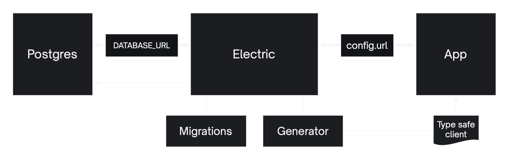

import FilteredDocCardList from '@site/src/components/FilteredDocCardList';

ElectricSQL is an open source system, designed for self-host. Once you’ve developed an app, you’ll need to deploy it to make it available to real users. Either on your own infrastructure, or to one or more managed hosting services.

## The ingredients of a successful deployment

ElectricSQL has three main components. Your Postgres database, the Electric sync service and your local-first app. Electric needs to be able to talk to Postgres and your app needs to be able to talk to Electric. You also need to apply migrations via the proxy and generate a type safe client when building your app.

Read the [Concepts guide](../deployment/concepts.md) for a comprehensive description of these components and how to connect and configure them. This includes details on the proxy tunnel option and different write modes between Electric and Postgres.

## Deployment options

<FilteredDocCardList filter={(x) => x.docId !== 'deployment/concepts'} />
