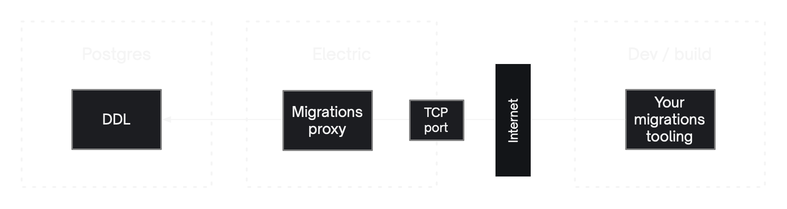

import Tabs from '@theme/Tabs';
import TabItem from '@theme/TabItem';
import CodeBlock from '@theme/CodeBlock';
import ExampleSchema from '!!raw-loader!./example.prisma';
import ExampleSQL from '!!raw-loader!./example.sql';

ElectricSQL is designed to work with and on top of a Postgres data model. Once you have a [data model](#your-data-model), you use [DDLX statements](../../api/ddlx.md) to expose parts of it, opting tables in to the Electric sync machinery and defining rules that control data access.

Electric does not impose a specific migrations system on you. Instead, you can use whichever [migrations tooling](#using-your-migrations-framework) you prefer to define your schema and apply DDLX statements. However, you must configure your migrations tooling to connect via the [Migrations proxy](#migrations-proxy).

:::caution
Any migrations or DDL statements that alter [electrified tables](./electrification.md) or use [DDLX syntax](../../api/ddlx.md) **must** be applied via the [Migrations proxy](#migrations-proxy).
:::

## Your data model

Electric works with an existing Postgres data model, aka DDL schema. The workflow is to:

1. opt tables into the Electric sync machinery by ["electrifying"](./electrification.md) them
2. grant and assign permissions to authorise data access using [DDLX statements](../../api/ddlx.md)

You can then sync data to your local app using [Shapes](../data-access/shapes.md).

For example, assuming you have an existing table called `projects`, you can electrify it, grant read access to the public and write access to the project owner using e.g.:

```sql
ALTER TABLE projects
  ENABLE ELECTRIC;

ELECTRIC ASSIGN 'projects:owner'
  TO projects.owner_id;

ELECTRIC GRANT ALL
  ON projects
  TO 'projects:owner';

ELECTRIC GRANT SELECT
  ON projects
  TO ANYONE;
```

:::caution Work in progress
The `ELECTRIC ASSIGN` and `ELECTRIC GRANT` DDLX statements are work in progress.

See the [Limitations](#limitations) section below and the [Roadmap](../../reference/roadmap.md) page for more context.
:::

### Creating a data model

If you need to create a data model, you can do so using SQL statements like `CREATE TABLE`, or a migrations tool like [Prisma](../../integrations/backend/prisma.md) or [Ecto](../../integrations/backend/phoenix.md).

Expand the box below for sample code:

<details>
  <summary>Copy code to create data model</summary>
  <Tabs groupId="migration-framework">
    <TabItem value="sql" label="SQL">
      <CodeBlock language="sql">
        {ExampleSQL}
      </CodeBlock>
    </TabItem>
    <TabItem value="prisma" label="Prisma">
      <CodeBlock language="js">
        {ExampleSchema}
      </CodeBlock>
    </TabItem>
  </Tabs>
</details>

## Using your migrations framework

You can use your prefered migrations tooling, often built into your [backend framework](../../integrations/backend/index.md) if you have one, to both define your DDL schema and to apply DDLX statements. For example:

<Tabs groupId="migration-framework">
  <TabItem value="ecto" label="Ecto">

With [Phoenix/Ecto](../../integrations/backend/phoenix.md) you can use the [`execute/1`](https://hexdocs.pm/ecto_sql/Ecto.Migration.html#execute/1) function.

First, create a migration:

```shell
mix ecto.gen.migration electrify_items
```

Then e.g.:

```elixir
defmodule MyApp.Repo.Migrations.ElectrifyItems do
  use Ecto.Migration

  def change do
    execute "ALTER TABLE items ENABLE ELECTRIC"
  end
end
```

  </TabItem>
  <TabItem value="laravel" label="Laravel">

With [Laravel](../../integrations/backend/laravel.md) you can use the [`statement` method on the `DB` facade](https://laravel.com/docs/10.x#databases-and-migrations).

First, create a migration:

```shell
php artisan make:migration electrify_items
```

Then use `DB::statement` in the `up` function:

```php
<?php

use Illuminate\Database\Migrations\Migration;
use Illuminate\Support\Facades\DB;

return new class extends Migration {
  public function up(): void {
    DB::statement("ALTER TABLE items ENABLE ELECTRIC");
  }
};
```

  </TabItem>
  <TabItem value="prisma" label="Prisma">

With [Prisma](../../integrations/backend/prisma.md) you [customize a migration to include an unsupported feature](https://www.prisma.io/docs/guides/migrate/developing-with-prisma-migrate/include-unsupported-database-features).

First, use the `--create-only` flag to generate a new migration without applying it:

```shell
npx prisma migrate dev --create-only
```

Open the generated migration.sql file and add the electrify call:

```sql
ALTER TABLE items ENABLE ELECTRIC;
```

Apply the migration:

```shell
npx prisma migrate dev
```

  </TabItem>
  <TabItem value="active-record" label="Rails">

With [Rails](../../integrations/backend/rails.md) you can `execute` SQL in the [`change` method](https://guides.rubyonrails.org/active_record_migrations.html#using-the-change-method) of your migration class.

First, create a migration:

```shell
rails generate migration ElectrifyItems
```

Then e.g.:

```ruby
class ElectrifyItems < ActiveRecord::Migration[7.0]
  def change
    execute "ALTER TABLE items ENABLE ELECTRIC"
  end
end
```

  </TabItem>
  <TabItem value="alembic" label="SQLAlchemy">

With [SQLAlchemy/Alembic](https://alembic.sqlalchemy.org) you can use the [`Operations.execute`](https://alembic.sqlalchemy.org/en/latest/ops.html#alembic.operations.Operations.execute) method.

First, create a migration:

```shell
alembic revision -m "electrify items"
```

Then execute the SQL in the `upgrade` function:

```python
# ... docstring and revision identifiers ...

from alembic import op
import sqlalchemy as sa

def upgrade():
    op.execute('ALTER TABLE items ENABLE ELECTRIC')
```

  </TabItem>
</Tabs>

See <DocPageLink path="integrations/backend" /> and <DocPageLink path="api/ddlx" /> for more information.

## Migrations proxy

Schema migrations to electrified tables must be applied to Postgres via a proxy server integrated into the Electric application. This proxy server:

1. enables [DDLX syntax](../../api/ddlx.md)
2. ensures [consistent propagation](../../reference/consistency.md) of schema changes to client applications
3. validates [electrified tables](./electrification.md) to ensure they are [supported](./types.md) by Electric
4. supports [type-safe Client](../data-access/client.md) generation using the CLI [`generate`](../../api/cli.md#generate) command

DDL migrations not applied via the proxy are not captured by Electric. This is fine if they do not use DDLX syntax or do not affect the electrified part of your schema (it's also fine if they affect tables that are electrified later on).

However, if they **do** use DDLX syntax or **do** affect the electrified part of your schema, then they **must** be applied via the proxy. If not, they will be rejected and an error will be raised.

:::info Not for DML
You do not need to route all your database access through the Migrations proxy. It is just intended to be used for DDL migrations, not for all your database writes and queries.
:::

:::info
Normal DML access to your Postgres **does not** need to be routed via the Migrations proxy. If your app has a backend, it should connect and interact with your database directly and Electric will happily pick up on the changes.

You can either route all DDL access to your Postgres via the Migrations proxy, or just the subset of DDL that impacts Electrified tables and/or uses DDLX statements. Trying to change an electrified table or use a DDLX statement without going through the proxy will raise an error.
:::

### Configuring and connecting to the migrations proxy

The [Electric sync service](../../api/service.md) connects to a Postgres database at [`DATABASE_URL`](../../api/service.md#database_url) and, by default, exposes the migrations proxy as a TCP service on `PG_PROXY_PORT`, secured by `PG_PROXY_PASSWORD`. Instead of connecting your migrations tooling (or any interactive session applying migrations) to Postgres directly, connect to the Electric sync service instead.

[](../../deployment/_images/tcp-port.jpg)

The migrations proxy intercepts your migrations, validates and transforms them and proxies them on to the Postgres at `DATABASE_URL`. Since the proxy speaks fluent Postgres, you can connect to it via any Postgres-compatible tool, e.g. `psql -U postgres -p 65432 electric`:

```console
$ PGPASSWORD=${PG_PROXY_PASSWORD} psql -U postgres -p ${PG_PROXY_PORT} electric

electric=# CREATE TABLE public.items (id text, value text);
CREATE TABLE
-- since we're connecting via the proxy, the DDLX syntax will work
electric=# ALTER TABLE public.items ENABLE ELECTRIC;
ELECTRIC ENABLE
-- this alter table statement affects the newly electrified items table
-- and so will be captured and streamed to any connected clients
electric=# ALTER TABLE public.items ADD COLUMN amount integer;
ALTER TABLE
```

See <DocPageLink path="api/service#migrations-proxy" /> for more information about configuring the sync service and <DocPageLink path="deployment/concepts#2-migrations---proxy" /> for a description of the different connection options.

### Framework integration

Your framework of choice will need to be configured in order to pass migrations (and _only_ migrations) through the proxy rather than directly to the underlying Postgres database.

This typically involves using a different database connection string for migrations, often by running your migrations command with a different `DATABASE_URL` that connects to the migrations proxy. However, as each framework has different requirements, we provide framework-specific example code for this in <DocPageLink path="integrations/backend" />.

:::caution Work in progress
If your framework of choice hasn't been documented yet, please feel free to [raise a feature request](https://github.com/electric-sql/electric/discussions/categories/feature-requests) or to [let us know on Discord](https://discord.electric-sql.com). We'll be happy to help you get up and running and ideally to work together to update the documentation.
:::

### Using the proxy tunnel

In some cases you may not be able to connect to the migrations proxy directly. For example, if your firewall or hosting provider don't support TCP access to the sync service on `PG_PROXY_PORT`. In these cases, you can use the [Proxy tunnel](../../api/cli.md#proxy-tunnel) to connect to the proxy using a TCP-over-HTTP tunnel.

[](../../deployment/_images/proxy-tunnel.jpg)

See <DocPageLink path="api/cli#proxy-tunnel" /> and <DocPageLink path="deployment/concepts#2-2-using-a-proxy-tunnel" /> for more information about using the proxy tunnel and <DocPageLink path="api/service#migrations-proxy" /> on configuring the sync service to support it.

## Limitations

There are currently a number of limitations on the data models and migrations that ElectricSQL supports.

### Default schema

Only tables in the default schema named [`public`](https://www.postgresql.org/docs/14/ddl-schemas.html#DDL-SCHEMAS-PUBLIC) can be electrified at the moment. We are working on lifting this restriction.

### Table names

The client generator sanitises table names (because of an issue in an [external library](https://github.com/chrishoermann/zod-prisma-types/issues/121)) removing any prefix that is not a letter and treating the first letter as case insensitive. As an example, electrifying the tables `_myTable`, `123myTable`, `myTable`, and `MyTable` will all clash on table name, causing a generator error.

### Forward migrations

We only currently support forward migrations. Rollbacks must be implemented as forward migrations.

### Additive migrations

We only currently support additive migrations. This means you can't remove or restrict a field. Instead, you need to create new fields and tables (that are pre-constrained on creation) and switch / mirror data to them.

In practice this means that we only support this subset of DDL actions:

- `CREATE TABLE` and its associated `ALTER TABLE <table name> ENABLE ELECTRIC` call
- `ALTER TABLE <electrified table> ADD COLUMN`
- `CREATE INDEX ON <electrified table>`, `DROP INDEX`. Indexes can be created and dropped because they don't affect the data within the electrified tables.

### No default values for columns

Currently it's not possible to electrify tables that have columns with `DEFAULT` clauses. This has to do with the fact that those clauses may include Postgres expressions that are difficult or impossible to translate into an SQLite-compatible one.

We will lift this limitation at some point, e.g. by discarding `DEFAULT` clauses in the SQLite schema or by supporting a limited set of default expressions.

### Data types and constraints

See the pages on [Types](./types.md) and [Constraints](./constraints.md).
