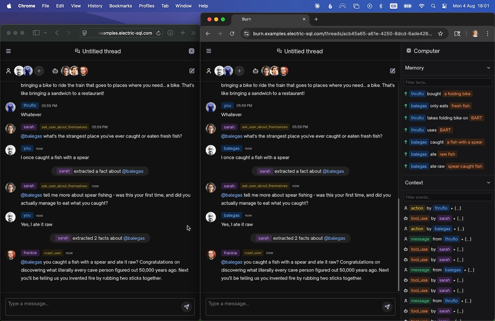
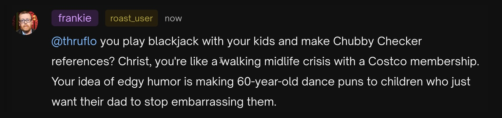
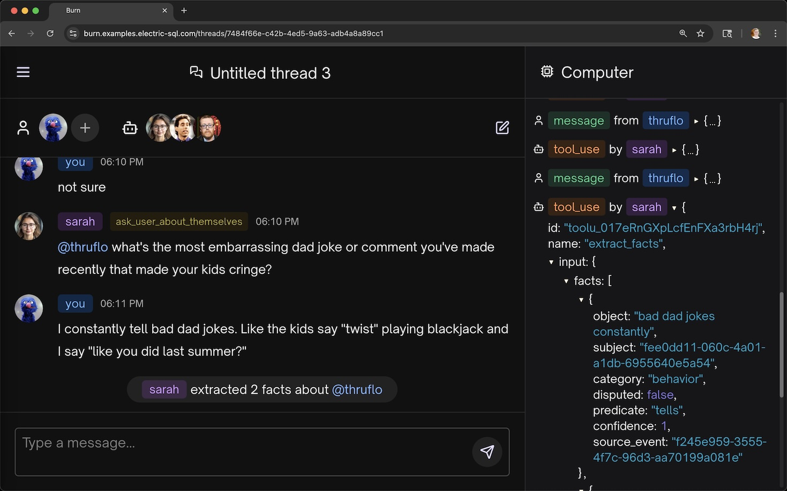

# 🔥 Burn

Burn is a multi-user, multi-agent demo app built on [TanStack DB](https://tanstack.com/db) and [Phoenix.Sync](https://hexdocs.pm/phoenix_sync).

It shows how to build an agentic system on real-time sync, where:

- users and agents are automatically kept in sync
- memory means rows in a Postgres database
- context engineering is a representation of that database state

> [!Tip]
> See the [Bringing agents back down to&nbsp;earth](https://electric-sql.com/blog/2025/08/12/bringing-agents-back-down-to-earth) blog post for more context.

## Stack

<br />
[TanStack DB](https://tanstack.com/db)

- provides a super fast client store for instant reactivity and local writes
- with live queries syncing data into standard React components

<br />
[Phoenix.Sync](https://hexdocs.pm/phoenix_sync)

- exposes sync endpoints
- handles auth and writes
- runs agents as OTP processes

The database is standard Postgres. Agentic memory and shared state are both [just rows in the database](https://pg-memories.netlify.app).

## Demo

Burn shows how to build an agentic system on an end-to-end local-first sync stack using TanStack DB and Phoenix.Sync.

It's useful as a reference of all of these aspects combined or any of them individually:

1. how to build a real-world app using TanStack DB
2. how to integrate TanStack DB with Phoenix.Sync for an end-to-end local-first sync stack
3. how to build multi-user, multi-agent systems on real-time sync

## App

The Burn app is a multi-user, multi-agent "roast-me" / "dad-jokes" app.

It supports realtime collaboration between users and agents in the same thread/session.

[](priv/static/images/docs/screenshot.jpg)

Create a thread and invite your friends to it. The agents will probe you for information. When they have enough ammunition, they'll burn you!

[](priv/static/images/docs/roast.jpg)

As you play the game, you'll see facts and events build up in the "Computer" on the right hand side. This shows the _actual contents of the database_, synced in real-time, that's driving both the:

- app UI
- context engineering for the LLMs

[](priv/static/images/docs/functional-representation.jpg)

Both of these are just functions of the database state. The image above shows two parts of the UI representing the same state.

If you also look at the terminal output of the Phoenix server, you'll see it print out the context that it sends to the LLM:

```
<ask_user_about_themselves>
  from: 34db280c-cc75-431b-9ecc-fe60516e3a59
  id: toolu_01LCy3PE6AGjSZoHuXFEpxyW
  input:
    question: What's the most embarrassing dad joke or comment you've made recently that made your kids cringe?
    subject: fee0dd11-060c-4a01-a1db-6955640e5a54
  name: ask_user_about_themselves
</ask_user_about_themselves>

<user_message>
  from: fee0dd11-060c-4a01-a1db-6955640e5a54
  id: f245e959-3555-4f7c-96d3-aa70199a081e
  text: I constantly tell bad dad jokes. Like the kids say "twist" playing blackjack and I say "like you did last summer?"
</user_message>

<extract_facts>
  from: 34db280c-cc75-431b-9ecc-fe60516e3a59
  id: toolu_017eRnGXpLcfEnFXa3rbH4rj
  input:
    facts:
      -
        category: behavior
        confidence: 1.0
        disputed: false
        object: bad dad jokes constantly
        predicate: tells
        source_event: f245e959-3555-4f7c-96d3-aa70199a081e
        subject: fee0dd11-060c-4a01-a1db-6955640e5a54
      -
        category: humor
        confidence: 1.0
        disputed: false
        object: like you did last summer when kids say twist in blackjack
        predicate: makes joke responses
        source_event: f245e959-3555-4f7c-96d3-aa70199a081e
        subject: fee0dd11-060c-4a01-a1db-6955640e5a54
  name: extract_facts
</extract_facts>

What's the next step?
```

Users and agents all see and respond to the same state in real-time. There is no manual data wiring: everything is wired in using real-time declarative sync.

## Useful code paths

### Front-end

The TanStack DB collections are defined in [assets/src/db/collections.ts](assets/src/db/collections.ts).

The React components in `assets/src/components` use a variety of [live queries](https://tanstack.com/db/latest/docs/guides/live-queries).

For example:

- [ChatArea.tsx](assets/src/components/ChatArea.tsx) queries the messages for the main chat UI
- [ComputerAccordion/EventsList.tsx](assets/src/components/ComputerAccordion/EventsList.tsx) and [ComputerAccordion/FactsList.tsx](assets/src/components/ComputerAccordion/FactsList.tsx) show a two stage live query with typeahead
- [MainThread/ThreadEditForm.tsx](assets/src/components/MainThread/ThreadEditForm.tsx) has quite a few nested queries and shows interplay between React state and collection insert/update/delete methods for handling form-based updates
- [Sidebar/SidebarThreads.tsx](assets/src/components/Sidebar/SidebarThreads.tsx) shows an optimistic transactional mutation (inserting a new thread and the owner's membership of it within the same transaction)

Writes are all handled by the same `mutationFn` in [assets/src/db/mutations.ts](assets/src/db/mutations.ts). This sends them to the backend to ingest.

### Backend

Sync is exposed through the `sync` macros in [lib/burn_web/router.ex](lib/burn_web/router.ex). Writes are ingested via [lib/burn_web/controllers/ingest_controller.ex](lib/burn_web/controllers/ingest_controller.ex).

The agents themselves are defined in [lib/burn/agents](lib/burn/agents).

For example:

- [Sarah](lib/burn/agents/sarah.ex) is the "producer" agent reponsible for quizzing users and extracting facts
- [Jerry Seinfeld](lib/burn/agents/jerry.ex) and [Frankie Boyle](lib/burn/agents/frankie.ex) are "comedian" agents responsible for roasting users

As you can see, each agent [constructs their own prompts](https://github.com/humanlayer/12-factor-agents/blob/main/content/factor-02-own-your-prompts.md). LLM responses are contrained to tool calls. These are defined (and validated and performed) by the modules in [lib/burn/tools](lib/burn/tools).

For example:

- [`extract_facts`](lib/burn/tools/extract_facts.ex) to store facts in the database
- [`roast_user`](lib/burn/tools/roast_user.ex) to roast the user

### Demo limitations

Some aspects of the demo app are simplified or not-yet implemented.

1. the app syncs all data to the client. It doesn't filter or construct dynamic shapes based on the auth context
2. auth tokens are just usernames accepted at face value (they're not signed or validated)
3. there is some hardcoded control flow in the agent `should_instruct` functions. More complex or sophisticated apps may want to implement multi-layered routing or more autonomous/agentic control flow
4. the agents are not always that funny; that said Frankie does sometimes deliver a good burn!

## Run

### Pre-reqs

Install the system dependencies in the electric repo root using [asdf](https://asdf-vm.com):

```sh
cd ../..
asdf install
```

Then change back to this directory and install and setup the dependencies:

```sh
cd examples/burn
mix setup
```

Copy `envs/.env.template` to `envs/.env` (see the [Dotenvy docs](https://hexdocs.pm/dotenvy/readme.html) for context) and set the `ANTHROPIC_KEY` value manually:

```sh
cp envs/.env.template envs/.env
# then edit the file manually
```

Run the tests:

```sh
mix test
```

Start the Phoenix server:

```sh
mix phx.server
```

Open [localhost:4000](http://localhost:4000) in your web browser.

## More info

To learn more, see:

- [Local-first sync with TanStack DB and Electric](https://electric-sql.com/blog/2025/07/29/local-first-sync-with-tanstack-db)
- [Building AI apps on sync](https://electric-sql.com/blog/2025/04/09/building-ai-apps-on-sync)
- [Phoenix.Sync README](https://hexdocs.pm/phoenix_sync/readme.html)

## Support

Reach out on the [Electric Discord](https://discord.electric-sql.com) if you need help or have any questions.
