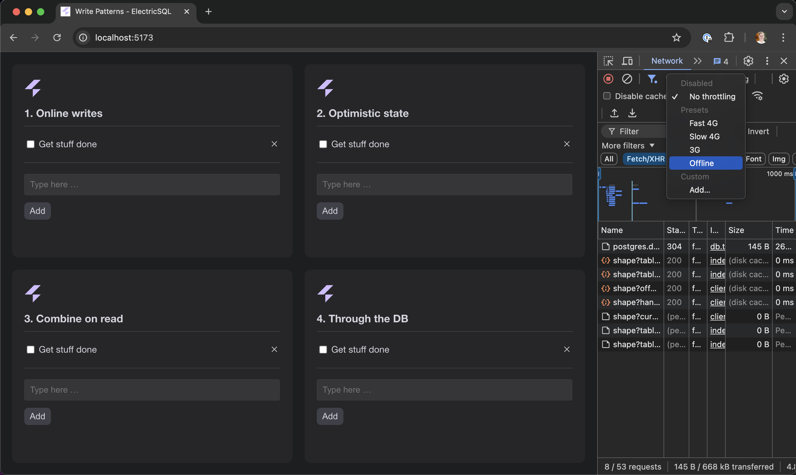

# Write patterns example

This example implements and describes four different patterns for handling writes in an application built with [ElectricSQL](https://electric-sql.com).

These patterns are described in the [Writes guide](https://electric-sql.com/docs/guides/writes) from the ElectricSQL documentation. It's worth reading the guide for context. The idea is that if you walk through these patterns in turn, you can get a sense of the range of techniques and their evolution in both power and complexity.

The example is set up to run all the patterns together, in the page, at the same time, as components of a single React application. So you can also evaluate their behaviour side-by-side and and with different network connectivity.

[](https://write-patterns.electric-sql.com)

You can see the example deployed and running online at:
https://write-patterns.examples.electric-sql.com

## Patterns

The main code is in the [`./patterns`](./patterns) folder, which has a subfolder for each pattern. There's also some shared code, including an API server and some app boilerplate in [`./shared`](./shared).

All of the patterns use [Electric](https://electric-sql.com/product/sync) for the read-path (i.e.: syncing data from Postgres into the local app) and implement a different approach to the write-path (i.e.: how they handle local writes and get data from the local app back into Postgres).

### [1. Online writes](./patterns/1-online-writes)

The first pattern is in [`./patterns/1-online-writes`](./patterns/1-online-writes).

This is the simplest approach, which just sends writes to an API and only works if you're online. It has a resilient client that will retry in the event of network failure but the app doesn't update until the write goes through.

### [2. Optimistic state](./patterns/2-optimistic-state)

The second pattern is in [`./patterns/2-optimistic-state`](./patterns/2-optimistic-state).

It extends the first pattern with support for local offline writes with simple optimistic state. The optimistic state is "simple" in the sense that it's only available within the component that makes the write and it's not persisted if the page reloads or the component unmounts.

### [3. Shared persistent optimistic state](./patterns/3-shared-persistent)

The third pattern is in [`./patterns/3-shared-persistent`](./patterns/3-shared-persistent).

It extends the second pattern by storing the optimistic state in a shared, persistent local store. This makes offline writes more resilient and avoids components getting out of sync. It's a compelling point in the design space: providing good UX and DX without introducing too much complexity or any heavy dependencies.

### [4. Through-the-database sync](./patterns/4-database-sync)

The fourth pattern is in [`./patterns/4-database-sync`](./patterns/4-database-sync).

It extends the concept of shared, persistent optimistic state all the way to a local embedded database. Specifically, it:

1. syncs data from Electric into an immutable table
2. persists local optimistic state in a shadow table
2. combines the two into a view that provides a unified interface for reads and writes
4. automatically detects local changes and syncs them to the server

This provides a pure local-first development experience, where the application code talks directly to a single database "table" and changes sync automatically in the background. However, this "power" does come at the cost of increased complexity in the form of an embedded database, complex local schema and loss of context when handling rollbacks.

## How to run

Make sure you've installed all dependencies for the monorepo and built the packages (from the monorepo root directory):

```shell
pnpm install
pnpm run -r build
```

Start the docker containers (in this directory):

```shell
pnpm backend:up
```

Start the dev server:

```shell
pnpm dev
```

When done, tear down the backend containers:

```shell
pnpm backend:down
```
